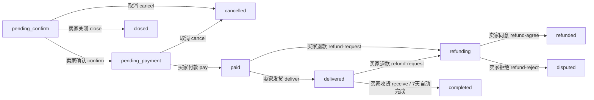
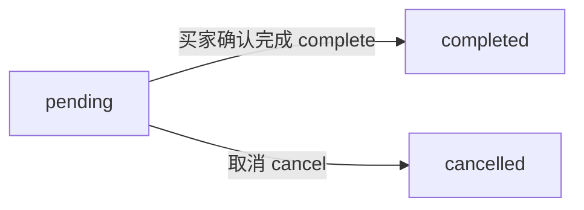

# 校园二手交易网站 API 接口文档

> 版本：v2.0 ｜ 最后更新：2026-08-15
> 本文档覆盖后端全部 REST 接口与 WebSocket 实时通信事件。

---

## 目录

- [基础信息](#基础信息)
- [通用约定](#通用约定)
- [1. 认证接口](#1-认证接口)
- [2. 用户接口](#2-用户接口)
- [3. 商品接口](#3-商品接口)
- [4. 评论接口](#4-评论接口)
- [5. 收藏接口](#5-收藏接口)
- [6. 议价接口](#6-议价接口)
- [7. 订单接口](#7-订单接口)
- [8. 聊天接口（REST）](#8-聊天接口rest)
- [9. WebSocket 实时通信](#9-websocket-实时通信)
- [10. 通知接口](#10-通知接口)
- [11. 举报接口](#11-举报接口)
- [12. 管理后台接口](#12-管理后台接口)
- [附录 A：数据模型字段](#附录-a数据模型字段)
- [附录 B：状态与枚举](#附录-b状态与枚举)
- [附录 C：接口汇总表](#附录-c接口汇总表)

---

## 基础信息

| 项 | 说明 |
|----|------|
| 基础 URL | `http://localhost:5000/api` |
| 数据格式 | JSON（上传接口使用 `multipart/form-data`） |
| 编码 | UTF-8 |
| 认证方式 | Bearer Token (JWT)，请求头 `Authorization: Bearer <token>` |
| Token 有效期 | 1 周（配置 `JWT_ACCESS_TOKEN_EXPIRES`） |
| 前端开发地址 | `http://localhost:5173`（CORS 已允许 5173/5174） |

---

## 通用约定

### 认证

需要登录的接口在请求头中携带：

```
Authorization: Bearer <access_token>
```

未携带或 Token 无效时返回：

```json
{ "error": "Missing JWT in headers" }
```
或
```json
{ "error": "Token has expired" }
```
状态码为 `401`。

### 响应格式

- **成功响应**：`{ "message": "...", ...业务字段 }`（部分接口无 `message`，直接返回业务字段）
- **错误响应**：`{ "error": "错误信息" }`，配合相应的 HTTP 状态码

### 分页

列表类接口统一支持分页查询参数：

| 参数名 | 类型 | 默认值 | 说明 |
|--------|------|--------|------|
| `page` | int | 1 | 页码 |
| `per_page` | int | 20（聊天消息为 50） | 每页数量 |

分页响应统一结构：

```json
{
    "items": [...],
    "total": 50,
    "pages": 5,
    "current_page": 1
}
```

> 具体业务字段名不同（`products` / `orders` / `notifications` 等），见各接口。

### 文件上传限制

- 单次请求最大 5MB（`MAX_CONTENT_LENGTH`）
- 头像允许格式：`png, jpg, jpeg, gif, webp, bmp, tiff, tif`
- 商品图允许格式：同上
- 头像自动缩放至 200×200 像素；商品图自动缩放至 800×800 像素

### HTTP 状态码约定

| 状态码 | 含义 |
|--------|------|
| 200 | 请求成功 |
| 201 | 创建成功 |
| 400 | 参数错误 / 业务校验失败 |
| 401 | 未登录或 Token 无效 |
| 403 | 无权限（非本人资源 / 非管理员） |
| 404 | 资源不存在 |
| 409 | 资源冲突（如邮箱已注册） |
| 500 | 服务器内部错误 |

---

## 1. 认证接口

### 1.1 用户注册

**接口地址：** `POST /auth/register`

**认证方式：** 无

**说明：** 新用户通过邮箱注册账号，密码使用 bcrypt 加密存储。

**请求参数（JSON）：**

| 参数名 | 类型 | 必填 | 说明 |
|--------|------|------|------|
| `email` | string | 是 | 校园邮箱地址 |
| `password` | string | 是 | 密码 |
| `nickname` | string | 否 | 用户昵称，默认取邮箱 @ 前部分 |

**请求示例：**

```json
{
    "email": "test@edu.cn",
    "password": "password123",
    "nickname": "小明"
}
```

**成功响应 (201)：**

```json
{
    "message": "Registration successful",
    "user": {
        "id": 1,
        "email": "test@edu.cn",
        "nickname": "小明",
        "avatar": "/static/images/default-avatar.png",
        "isAdmin": false,
        "created_at": "2024-01-15T10:30:00.000000"
    }
}
```

**错误响应：**

| HTTP 状态码 | 错误信息 |
|-------------|---------|
| 400 | `Missing required fields: email, password` |
| 409 | `Email already registered` |

---

### 1.2 用户登录

**接口地址：** `POST /auth/login`

**认证方式：** 无

**说明：** 用户使用邮箱密码登录，返回用户信息与访问令牌。

**请求参数（JSON）：**

| 参数名 | 类型 | 必填 | 说明 |
|--------|------|------|------|
| `email` | string | 是 | 注册邮箱 |
| `password` | string | 是 | 密码 |

**请求示例：**

```json
{
    "email": "test@edu.cn",
    "password": "password123"
}
```

**成功响应 (200)：**

```json
{
    "message": "Login successful",
    "user": {
        "id": 1,
        "email": "test@edu.cn",
        "nickname": "小明",
        "avatar": "/static/images/default-avatar.png",
        "isAdmin": false,
        "created_at": "2024-01-15T10:30:00.000000"
    },
    "access_token": "eyJhbGciOiJIUzI1NiIsInR5cCI6IkpXVCJ9..."
}
```

**错误响应：**

| HTTP 状态码 | 错误信息 |
|-------------|---------|
| 400 | `Missing email or password` |
| 401 | `Invalid email or password` |

---

## 2. 用户接口

### 2.1 获取用户信息

**接口地址：** `GET /user/profile`

**认证方式：** 需要 JWT

**说明：** 获取当前登录用户的详细信息。

**成功响应 (200)：**

```json
{
    "user": {
        "id": 1,
        "email": "test@edu.cn",
        "nickname": "小明",
        "avatar": "/static/images/default-avatar.png",
        "isAdmin": false,
        "created_at": "2024-01-15T10:30:00.000000"
    }
}
```

**错误响应：**

| HTTP 状态码 | 错误信息 |
|-------------|---------|
| 401 | 未登录或 Token 无效 |
| 404 | `User not found` |

---

### 2.2 更新用户信息

**接口地址：** `PUT /user/profile`

**认证方式：** 需要 JWT

**说明：** 更新当前用户的昵称和/或头像。支持 JSON 或 `multipart/form-data` 两种格式。

**请求参数：**

| 参数名 | 类型 | 必填 | 说明 |
|--------|------|------|------|
| `nickname` | string | 否 | 新昵称 |
| `avatar` | file | 否 | 头像图片文件（multipart 方式） |

**请求示例（JSON）：**

```json
{
    "nickname": "小明同学"
}
```

**请求示例（multipart/form-data）：**

```
nickname: 小明同学
avatar: (文件)
```

**成功响应 (200)：**

```json
{
    "message": "Profile updated successfully",
    "user": {
        "id": 1,
        "email": "test@edu.cn",
        "nickname": "小明同学",
        "avatar": "/uploads/avatars/abc123def.png",
        "isAdmin": false,
        "created_at": "2024-01-15T10:30:00.000000"
    }
}
```

**错误响应：**

| HTTP 状态码 | 错误信息 |
|-------------|---------|
| 400 | `No selected file` / `Invalid file type...` |
| 401 | 未登录或 Token 无效 |
| 404 | `User not found` |
| 500 | 服务器处理失败 |

---

### 2.3 上传用户头像

**接口地址：** `POST /user/avatar`

**认证方式：** 需要 JWT

**说明：** 单独上传用户头像，自动压缩到 200×200 像素。

**请求格式：** `multipart/form-data`

**请求参数：**

| 参数名 | 类型 | 必填 | 说明 |
|--------|------|------|------|
| `avatar` | file | 是 | 图片文件（png/jpg/jpeg/gif/webp/bmp/tiff/tif） |

**成功响应 (200)：**

```json
{
    "message": "Avatar uploaded successfully",
    "user": {
        "id": 1,
        "email": "test@edu.cn",
        "nickname": "小明",
        "avatar": "/uploads/avatars/abc123def.png",
        "isAdmin": false,
        "created_at": "2024-01-15T10:30:00.000000"
    }
}
```

**错误响应：**

| HTTP 状态码 | 错误信息 |
|-------------|---------|
| 400 | `No avatar file provided` / `No selected file` / `Invalid file type...` |
| 401 | 未登录或 Token 无效 |
| 404 | `User not found` |
| 500 | 服务器处理失败 |

---

## 3. 商品接口

### 3.1 发布商品

**接口地址：** `POST /products`

**认证方式：** 需要 JWT

**说明：** 已登录用户发布二手商品。支持 JSON 或 `multipart/form-data`（含图片）。

**请求参数：**

| 参数名 | 类型 | 必填 | 说明 |
|--------|------|------|------|
| `title` | string | 是 | 商品标题 |
| `price` | number | 是 | 商品价格，必须大于 0 |
| `description` | string | 否 | 商品描述，默认空字符串 |
| `category` | string | 否 | 商品分类，默认 `其他` |
| `image` | file | 否 | 商品图片（multipart 方式，最大 800×800） |

**请求示例（JSON）：**

```json
{
    "title": "二手Python编程教材",
    "price": 29.99,
    "description": "9成新，无划痕",
    "category": "书籍教材"
}
```

**成功响应 (201)：**

```json
{
    "message": "Product created successfully",
    "product": {
        "id": 1,
        "seller_id": 1,
        "seller": { "id": 1, "nickname": "小明" },
        "title": "二手Python编程教材",
        "description": "9成新，无划痕",
        "price": 29.99,
        "category": "书籍教材",
        "image": "/static/images/default-product.png",
        "status": "active",
        "created_at": "2024-01-15T11:00:00.000000",
        "comment_count": 0
    }
}
```

**错误响应：**

| HTTP 状态码 | 错误信息 |
|-------------|---------|
| 400 | `Missing required field: title` / `Missing required field: price` / `Invalid price format` / `Price must be positive` |
| 401 | 未登录或 Token 无效 / `Invalid token` |
| 404 | `User not found` |

---

### 3.2 商品列表

**接口地址：** `GET /products`

**认证方式：** 无

**说明：** 获取商品列表，支持分页、筛选、搜索与排序。未指定 `seller_id` 时默认只返回 `active` 状态的商品。

**查询参数：**

| 参数名 | 类型 | 必填 | 说明 |
|--------|------|------|------|
| `page` | int | 否 | 页码，默认 1 |
| `per_page` | int | 否 | 每页数量，默认 20 |
| `category` | string | 否 | 按分类精确筛选 |
| `keyword` | string | 否 | 按标题关键词模糊搜索 |
| `sort_by` | string | 否 | 排序字段：`created_at`(默认) / `price` / `title` |
| `sort_order` | string | 否 | 排序方向：`desc`(默认) / `asc` |
| `seller_id` | int | 否 | 按卖家筛选（会返回该卖家全部状态商品） |
| `status` | string | 否 | 按状态筛选：`active` / `inactive` / `sold` / `removed` 等 |

**请求示例：**

```
GET /products?page=1&per_page=10&category=书籍教材&keyword=Python&sort_by=price&sort_order=asc
```

**成功响应 (200)：**

```json
{
    "products": [
        {
            "id": 1,
            "seller_id": 1,
            "seller": { "id": 1, "nickname": "小明" },
            "title": "二手Python编程教材",
            "description": "9成新，无划痕",
            "price": 29.99,
            "category": "书籍教材",
            "image": "/static/images/default-product.png",
            "status": "active",
            "created_at": "2024-01-15T11:00:00.000000",
            "comment_count": 3
        }
    ],
    "total": 50,
    "pages": 5,
    "current_page": 1
}
```

---

### 3.3 商品详情

**接口地址：** `GET /products/{product_id}`

**认证方式：** 无

**路径参数：**

| 参数名 | 类型 | 必填 | 说明 |
|--------|------|------|------|
| `product_id` | int | 是 | 商品 ID |

**请求示例：**

```
GET /products/1
```

**成功响应 (200)：**

```json
{
    "product": {
        "id": 1,
        "seller_id": 1,
        "seller": { "id": 1, "nickname": "小明" },
        "title": "二手Python编程教材",
        "description": "9成新，无划痕",
        "price": 29.99,
        "category": "书籍教材",
        "image": "/static/images/default-product.png",
        "status": "active",
        "created_at": "2024-01-15T11:00:00.000000",
        "comment_count": 3
    }
}
```

**错误响应：**

| HTTP 状态码 | 错误信息 |
|-------------|---------|
| 404 | `Product not found` |

---

### 3.4 更新商品

**接口地址：** `PUT /products/{product_id}`

**认证方式：** 需要 JWT（仅卖家本人或管理员）

**说明：** 更新商品信息。非本人操作返回 403。

**请求参数（均为可选，支持 JSON 或 multipart）：**

| 参数名 | 类型 | 说明 |
|--------|------|------|
| `title` | string | 商品标题 |
| `description` | string | 商品描述 |
| `price` | number | 商品价格 |
| `category` | string | 商品分类 |
| `status` | string | 商品状态 |
| `image` | file | 商品图片 |

**成功响应 (200)：**

```json
{
    "message": "Product updated successfully",
    "product": { "...": "更新后的商品对象，结构同 3.3" }
}
```

**错误响应：**

| HTTP 状态码 | 错误信息 |
|-------------|---------|
| 400 | `Invalid price format` |
| 401 | 未登录或 Token 无效 |
| 403 | `You can only update your own products` |
| 404 | `Product not found` |

---

### 3.5 删除商品

**接口地址：** `DELETE /products/{product_id}`

**认证方式：** 需要 JWT（仅卖家本人）

**说明：** 删除商品及其关联评论、收藏记录。

**成功响应 (200)：**

```json
{ "message": "Product deleted successfully" }
```

**错误响应：**

| HTTP 状态码 | 错误信息 |
|-------------|---------|
| 401 | 未登录或 Token 无效 |
| 403 | `You can only delete your own products` |
| 404 | `Product not found` |

---

### 3.6 商品分类列表

**接口地址：** `GET /categories`

**认证方式：** 无

**说明：** 获取平台支持的商品分类列表。

**成功响应 (200)：**

```json
{
    "categories": ["书籍教材", "电子数码", "生活用品", "交通工具", "体育用品", "服饰鞋包", "美妆护肤", "其他"]
}
```

---

## 4. 评论接口

### 4.1 获取商品评论

**接口地址：** `GET /products/{product_id}/comments`

**认证方式：** 无

**查询参数：** `page`（默认 1）、`per_page`（默认 20）

**成功响应 (200)：**

```json
{
    "comments": [
        {
            "id": 1,
            "product_id": 1,
            "user": {
                "id": 2,
                "nickname": "小红",
                "avatar": "/static/images/default-avatar.png"
            },
            "content": "请问可以小刀吗？",
            "created_at": "2024-01-16T09:00:00.000000"
        }
    ],
    "total": 3,
    "pages": 1,
    "current_page": 1
}
```

**错误响应：**

| HTTP 状态码 | 错误信息 |
|-------------|---------|
| 404 | `Product not found` |

---

### 4.2 添加评论

**接口地址：** `POST /products/{product_id}/comments`

**认证方式：** 需要 JWT

**请求参数（JSON）：**

| 参数名 | 类型 | 必填 | 说明 |
|--------|------|------|------|
| `content` | string | 是 | 评论内容，非空，最长 500 字 |

**请求示例：**

```json
{ "content": "请问可以小刀吗？" }
```

**成功响应 (201)：**

```json
{
    "message": "Comment added successfully",
    "comment": {
        "id": 1,
        "product_id": 1,
        "user": { "id": 2, "nickname": "小红", "avatar": "/static/images/default-avatar.png" },
        "content": "请问可以小刀吗？",
        "created_at": "2024-01-16T09:00:00.000000"
    }
}
```

**错误响应：**

| HTTP 状态码 | 错误信息 |
|-------------|---------|
| 400 | `Missing comment content` / `Comment content cannot be empty` / `Comment content cannot exceed 500 characters` |
| 401 | 未登录或 Token 无效 |
| 404 | `Product not found` / `User not found` |

---

### 4.3 删除评论

**接口地址：** `DELETE /comments/{comment_id}`

**认证方式：** 需要 JWT（仅评论作者本人）

**成功响应 (200)：**

```json
{ "message": "Comment deleted successfully" }
```

**错误响应：**

| HTTP 状态码 | 错误信息 |
|-------------|---------|
| 401 | 未登录或 Token 无效 |
| 403 | `You can only delete your own comments` |
| 404 | `Comment not found` |

---

## 5. 收藏接口

### 5.1 添加收藏

**接口地址：** `POST /favorites`

**认证方式：** 需要 JWT

**请求参数（JSON）：**

| 参数名 | 类型 | 必填 | 说明 |
|--------|------|------|------|
| `product_id` | int | 是 | 商品 ID |

**成功响应 (201)：**

```json
{
    "message": "Added to favorites",
    "favorite": {
        "id": 1,
        "user_id": 2,
        "product_id": 1,
        "product": { "...": "商品对象" },
        "created_at": "2024-01-16T09:00:00.000000"
    }
}
```

**错误响应：**

| HTTP 状态码 | 错误信息 |
|-------------|---------|
| 400 | `Missing product_id` / `Product already in favorites` |
| 401 | 未登录或 Token 无效 |
| 404 | `Product not found` |

---

### 5.2 收藏列表

**接口地址：** `GET /favorites`

**认证方式：** 需要 JWT

**说明：** 获取当前用户的收藏列表，支持分页（`page` / `per_page`）。

**成功响应 (200)：**

```json
{
    "favorites": [
        {
            "id": 1,
            "user_id": 2,
            "product_id": 1,
            "product": { "...": "商品对象" },
            "created_at": "2024-01-16T09:00:00.000000"
        }
    ],
    "total": 10,
    "pages": 1,
    "current_page": 1
}
```

---

### 5.3 取消收藏

**接口地址：** `DELETE /favorites/{product_id}`

**认证方式：** 需要 JWT

**成功响应 (200)：**

```json
{ "message": "Removed from favorites" }
```

**错误响应：**

| HTTP 状态码 | 错误信息 |
|-------------|---------|
| 401 | 未登录或 Token 无效 |
| 404 | `Favorite not found` |

---

### 5.4 检查收藏状态

**接口地址：** `GET /favorites/check/{product_id}`

**认证方式：** 需要 JWT

**成功响应 (200)：**

```json
{ "is_favorite": true }
```

---

## 6. 议价接口

### 6.1 发起议价

**接口地址：** `POST /offers`

**认证方式：** 需要 JWT

**说明：** 买家对商品发起议价。同一买家对同一商品存在 `pending` 议价时不可重复发起；已完成的议价可重新发起（更新原记录）。

**请求参数（JSON）：**

| 参数名 | 类型 | 必填 | 说明 |
|--------|------|------|------|
| `product_id` | int | 是 | 商品 ID |
| `offered_price` | number | 是 | 期望价格，必须大于 0 |
| `message` | string | 否 | 议价留言 |

**成功响应 (201)：**

```json
{
    "message": "Offer created successfully",
    "offer": {
        "id": 1,
        "product_id": 1,
        "product": { "...": "商品对象" },
        "buyer_id": 2,
        "buyer": { "id": 2, "nickname": "小红", "avatar": "/static/images/default-avatar.png" },
        "seller_id": 1,
        "offered_price": 25.0,
        "original_price": 29.99,
        "status": "pending",
        "message": "25元可以吗？",
        "created_at": "2024-01-16T09:00:00.000000",
        "updated_at": "2024-01-16T09:00:00.000000"
    }
}
```

> 若为重新发起（更新旧记录），返回 200 与 `Offer updated successfully`。

**错误响应：**

| HTTP 状态码 | 错误信息 |
|-------------|---------|
| 400 | `Missing product_id` / `Missing offered_price` / `You cannot make an offer on your own product` / `Product is not available` / `Invalid price format` / `Offered price must be positive` / `You already have a pending offer for this product` |
| 401 | 未登录或 Token 无效 |
| 404 | `Product not found` |

---

### 6.2 卖家议价列表

**接口地址：** `GET /offers/seller`

**认证方式：** 需要 JWT

**说明：** 获取当前用户作为卖家收到的议价列表。

**查询参数：**

| 参数名 | 类型 | 必填 | 说明 |
|--------|------|------|------|
| `status` | string | 否 | 按状态筛选，默认 `pending` |
| `product_id` | int | 否 | 按商品筛选 |
| `page` / `per_page` | int | 否 | 分页 |

**成功响应 (200)：**

```json
{
    "offers": [ { "...": "议价对象，结构同 6.1" } ],
    "total": 5,
    "pages": 1,
    "current_page": 1
}
```

---

### 6.3 买家议价列表

**接口地址：** `GET /offers/buyer`

**认证方式：** 需要 JWT

**说明：** 获取当前用户作为买家发起的议价列表。

**查询参数：**

| 参数名 | 类型 | 必填 | 说明 |
|--------|------|------|------|
| `status` | string | 否 | 按状态筛选（默认不过滤） |
| `product_id` | int | 否 | 按商品筛选 |
| `page` / `per_page` | int | 否 | 分页 |

**成功响应 (200)：**

```json
{
    "offers": [ { "...": "议价对象" } ],
    "total": 3,
    "pages": 1,
    "current_page": 1
}
```

---

### 6.4 接受议价

**接口地址：** `POST /offers/{offer_id}/accept`

**认证方式：** 需要 JWT（仅卖家本人）

**说明：** 卖家接受议价，商品价格将更新为议价价格，议价状态变为 `accepted`。

**成功响应 (200)：**

```json
{
    "message": "Offer accepted successfully",
    "offer": { "...": "议价对象，status=accepted" }
}
```

**错误响应：**

| HTTP 状态码 | 错误信息 |
|-------------|---------|
| 400 | `Offer is not pending` |
| 401 | 未登录或 Token 无效 |
| 403 | `You can only accept your own offers` |
| 404 | `Offer not found` |

---

### 6.5 拒绝议价

**接口地址：** `POST /offers/{offer_id}/reject`

**认证方式：** 需要 JWT（仅卖家本人）

**成功响应 (200)：**

```json
{
    "message": "Offer rejected successfully",
    "offer": { "...": "议价对象，status=rejected" }
}
```

**错误响应：** 同 6.4（`Offer is not pending` / 403 / 404）。

---

### 6.6 取消议价

**接口地址：** `POST /offers/{offer_id}/cancel`

**认证方式：** 需要 JWT（仅买家本人）

**说明：** 买家取消自己 pending 状态的议价。

**成功响应 (200)：**

```json
{
    "message": "Offer canceled successfully",
    "offer": { "...": "议价对象，status=canceled" }
}
```

**错误响应：**

| HTTP 状态码 | 错误信息 |
|-------------|---------|
| 400 | `Only pending offers can be canceled` |
| 401 | 未登录或 Token 无效 |
| 403 | `You can only cancel your own offers` |
| 404 | `Offer not found` |

---

## 7. 订单接口

### 7.1 创建订单

**接口地址：** `POST /orders`

**认证方式：** 需要 JWT

**说明：** 买家对商品下单。线下交易初始状态为 `pending`，线上交易初始状态为 `pending_confirm`。创建后自动通知卖家。

**请求参数（JSON）：**

| 参数名 | 类型 | 必填 | 说明 |
|--------|------|------|------|
| `product_id` | int | 是 | 商品 ID |
| `final_price` | number | 是 | 成交价格，必须大于 0 |
| `transaction_type` | string | 否 | 交易方式：`offline`(默认) / `online` |

**请求示例：**

```json
{
    "product_id": 1,
    "final_price": 29.99,
    "transaction_type": "offline"
}
```

**成功响应 (201)：**

```json
{
    "message": "Order created successfully",
    "order": {
        "id": 1,
        "product_id": 1,
        "product": { "id": 1, "title": "二手Python编程教材", "image": "/static/images/default-product.png", "price": 29.99 },
        "buyer_id": 2,
        "buyer": { "id": 2, "nickname": "小红", "avatar": "/static/images/default-avatar.png" },
        "seller_id": 1,
        "seller": { "id": 1, "nickname": "小明", "avatar": "/static/images/default-avatar.png" },
        "final_price": 29.99,
        "status": "pending",
        "transaction_type": "offline",
        "payment_method": null,
        "paid_at": null,
        "delivery_method": null,
        "tracking_number": null,
        "auto_complete_at": null,
        "created_at": "2024-01-16T09:00:00.000000",
        "updated_at": "2024-01-16T09:00:00.000000"
    }
}
```

**错误响应：**

| HTTP 状态码 | 错误信息 |
|-------------|---------|
| 400 | `Missing product_id` / `Missing final_price` / `Invalid transaction_type, must be offline or online` / `You cannot create an order for your own product` / `Product is not available` / `Invalid price format` / `Price must be positive` / `You already have an active order for this product` |
| 401 | 未登录或 Token 无效 |
| 404 | `Product not found` |

---

### 7.2 订单列表

**接口地址：** `GET /orders`

**认证方式：** 需要 JWT

**查询参数：**

| 参数名 | 类型 | 必填 | 说明 |
|--------|------|------|------|
| `role` | string | 否 | `buy`(默认，我买到的) / `sell`(我卖出的) |
| `status` | string | 否 | 按订单状态筛选 |
| `page` / `per_page` | int | 否 | 分页 |

**成功响应 (200)：**

```json
{
    "orders": [ { "...": "订单对象，结构同 7.1" } ],
    "total": 20,
    "pages": 1,
    "current_page": 1
}
```

---

### 7.3 订单详情

**接口地址：** `GET /orders/{order_id}`

**认证方式：** 需要 JWT（仅订单买家或卖家）

**成功响应 (200)：**

```json
{ "order": { "...": "订单对象" } }
```

**错误响应：**

| HTTP 状态码 | 错误信息 |
|-------------|---------|
| 401 | 未登录或 Token 无效 |
| 403 | `You can only view your own orders` |
| 404 | `Order not found` |

---

### 7.4 完成订单（线下）

**接口地址：** `PUT /orders/{order_id}/complete`

**认证方式：** 需要 JWT（仅买家）

**说明：** 线下交易中买家确认交易完成，商品状态变为 `sold`，并通知卖家。

**成功响应 (200)：**

```json
{
    "message": "Order completed successfully",
    "order": { "...": "订单对象，status=completed" }
}
```

**错误响应：**

| HTTP 状态码 | 错误信息 |
|-------------|---------|
| 400 | `线上交易请使用确认收货接口` / `Only pending orders can be completed` |
| 401 | 未登录或 Token 无效 |
| 403 | `Only the buyer can confirm completion` |
| 404 | `Order not found` |

---

### 7.5 取消订单

**接口地址：** `PUT /orders/{order_id}/cancel`

**认证方式：** 需要 JWT（仅订单买家或卖家）

**说明：** 取消订单，仅限 `pending` / `pending_confirm` / `pending_payment` 状态。取消后通知对方。

**成功响应 (200)：**

```json
{
    "message": "Order cancelled successfully",
    "order": { "...": "订单对象，status=cancelled" }
}
```

**错误响应：**

| HTTP 状态码 | 错误信息 |
|-------------|---------|
| 400 | `当前状态不可取消` |
| 401 | 未登录或 Token 无效 |
| 403 | `You can only cancel your own orders` |
| 404 | `Order not found` |

---

### 7.6 卖家确认订单（线上）

**接口地址：** `PUT /orders/{order_id}/confirm`

**认证方式：** 需要 JWT（仅卖家）

**说明：** 线上交易中卖家确认订单，状态变为 `pending_payment`，并通知买家付款。

**成功响应 (200)：**

```json
{
    "message": "Order confirmed",
    "order": { "...": "订单对象，status=pending_payment" }
}
```

**错误响应：**

| HTTP 状态码 | 错误信息 |
|-------------|---------|
| 400 | `仅线上交易需要确认` / `当前状态不可确认` |
| 401 | 未登录或 Token 无效 |
| 403 | `Only the seller can confirm the order` |
| 404 | `Order not found` |

---

### 7.7 卖家关闭订单（线上）

**接口地址：** `PUT /orders/{order_id}/close`

**认证方式：** 需要 JWT（仅卖家）

**说明：** 线上交易中卖家在买家付款前关闭订单，状态变为 `closed`。

**成功响应 (200)：**

```json
{
    "message": "Order closed",
    "order": { "...": "订单对象，status=closed" }
}
```

**错误响应：**

| HTTP 状态码 | 错误信息 |
|-------------|---------|
| 400 | `仅线上交易可关闭` / `当前状态不可关闭` |
| 401 | 未登录或 Token 无效 |
| 403 | `Only the seller can close the order` |
| 404 | `Order not found` |

---

### 7.8 买家付款（线上）

**接口地址：** `POST /orders/{order_id}/pay`

**认证方式：** 需要 JWT（仅买家）

**说明：** 模拟支付。状态变为 `paid`，记录付款时间与支付方式 `balance`，创建 `pay` 类型交易流水，并通知卖家。

**成功响应 (200)：**

```json
{
    "message": "Payment successful",
    "order": { "...": "订单对象，status=paid，payment_method=balance" }
}
```

**错误响应：**

| HTTP 状态码 | 错误信息 |
|-------------|---------|
| 400 | `仅线上交易可付款` / `当前状态不可付款` |
| 401 | 未登录或 Token 无效 |
| 403 | `Only the buyer can pay` |
| 404 | `Order not found` |

---

### 7.9 卖家发货（线上）

**接口地址：** `PUT /orders/{order_id}/deliver`

**认证方式：** 需要 JWT（仅卖家）

**请求参数（JSON，可选）：**

| 参数名 | 类型 | 说明 |
|--------|------|------|
| `tracking_number` | string | 快递单号（有则 `delivery_method=shipped`，无则 `offline`） |

**说明：** 状态变为 `delivered`，设置 7 天自动完成时间 `auto_complete_at`，并通知买家。

**成功响应 (200)：**

```json
{
    "message": "Delivery confirmed",
    "order": { "...": "订单对象，status=delivered" }
}
```

**错误响应：**

| HTTP 状态码 | 错误信息 |
|-------------|---------|
| 400 | `仅线上交易可发货` / `当前状态不可发货` |
| 401 | 未登录或 Token 无效 |
| 403 | `Only the seller can mark as delivered` |
| 404 | `Order not found` |

---

### 7.10 买家确认收货（线上）

**接口地址：** `PUT /orders/{order_id}/receive`

**认证方式：** 需要 JWT（仅买家）

**说明：** 买家确认收货，状态变为 `completed`，商品状态变为 `sold`，并通知卖家。

**成功响应 (200)：**

```json
{
    "message": "Receipt confirmed, transaction completed",
    "order": { "...": "订单对象，status=completed" }
}
```

**错误响应：**

| HTTP 状态码 | 错误信息 |
|-------------|---------|
| 400 | `仅线上交易可确认收货` / `当前状态不可确认收货` |
| 401 | 未登录或 Token 无效 |
| 403 | `Only the buyer can confirm receipt` |
| 404 | `Order not found` |

---

### 7.11 自动确认收货（管理员触发）

**接口地址：** `POST /orders/auto-complete`

**认证方式：** 需要 JWT（仅管理员）

**说明：** 手动触发自动确认收货检查，将所有 `delivered` 且超过 `auto_complete_at` 的订单自动完成。生产环境应由定时任务调用。

**成功响应 (200)：**

```json
{ "message": "Auto-completed 3 orders" }
```

**错误响应：**

| HTTP 状态码 | 错误信息 |
|-------------|---------|
| 401 | 未登录或 Token 无效 |
| 403 | `Admin only` |

---

### 7.12 申请退款（线上）

**接口地址：** `POST /orders/{order_id}/refund-request`

**认证方式：** 需要 JWT（仅买家）

**说明：** 线上订单已付款（`paid`）或已发货（`delivered`）状态下买家可申请退款，状态变为 `refunding`，并通知卖家。

**成功响应 (200)：**

```json
{
    "message": "Refund requested",
    "order": { "...": "订单对象，status=refunding" }
}
```

**错误响应：**

| HTTP 状态码 | 错误信息 |
|-------------|---------|
| 400 | `仅线上交易可退款` / `当前状态不可申请退款` |
| 401 | 未登录或 Token 无效 |
| 403 | `Only the buyer can request refund` |
| 404 | `Order not found` |

---

### 7.13 同意退款（线上）

**接口地址：** `PUT /orders/{order_id}/refund-agree`

**认证方式：** 需要 JWT（仅卖家）

**说明：** 卖家同意退款，状态变为 `refunded`，创建 `refund` 类型交易流水，并通知买家。

**成功响应 (200)：**

```json
{
    "message": "Refund agreed, money returned",
    "order": { "...": "订单对象，status=refunded" }
}
```

**错误响应：**

| HTTP 状态码 | 错误信息 |
|-------------|---------|
| 400 | `仅线上交易可退款` / `当前状态不可同意退款` |
| 401 | 未登录或 Token 无效 |
| 403 | `Only the seller can agree refund` |
| 404 | `Order not found` |

---

### 7.14 拒绝退款（线上）

**接口地址：** `PUT /orders/{order_id}/refund-reject`

**认证方式：** 需要 JWT（仅卖家）

**说明：** 卖家拒绝退款，状态变为 `disputed`（争议），并通知买家平台将介入处理。

**成功响应 (200)：**

```json
{
    "message": "Refund rejected, dispute created",
    "order": { "...": "订单对象，status=disputed" }
}
```

**错误响应：**

| HTTP 状态码 | 错误信息 |
|-------------|---------|
| 400 | `仅线上交易可退款` / `当前状态不可拒绝退款` |
| 401 | 未登录或 Token 无效 |
| 403 | `Only the seller can reject refund` |
| 404 | `Order not found` |

---

### 7.15 交易流水

**接口地址：** `GET /orders/{order_id}/transactions`

**认证方式：** 需要 JWT（仅订单买家或卖家）

**成功响应 (200)：**

```json
{
    "transactions": [
        {
            "id": 1,
            "order_id": 1,
            "amount": 29.99,
            "type": "pay",
            "status": "success",
            "transaction_no": "TX20240116120000123ABC4567",
            "created_at": "2024-01-16T12:00:00.000000"
        }
    ]
}
```

**错误响应：**

| HTTP 状态码 | 错误信息 |
|-------------|---------|
| 401 | 未登录或 Token 无效 |
| 403 | `You can only view your own orders` |
| 404 | `Order not found` |

---

## 8. 聊天接口（REST）

### 8.1 会话列表

**接口地址：** `GET /conversations`

**认证方式：** 需要 JWT

**说明：** 获取当前用户的会话列表，按最后消息时间倒序排列。

**成功响应 (200)：**

```json
{
    "conversations": [
        {
            "id": 1,
            "buyer_id": 2,
            "seller_id": 1,
            "product_id": 1,
            "product_title": "二手Python编程教材",
            "product_image": "/uploads/products/xxx.png",
            "other_user": {
                "id": 1,
                "nickname": "小明",
                "avatar": "/static/images/default-avatar.png"
            },
            "last_message": "你好，还在吗？",
            "last_message_at": "2024-01-16T10:00:00.000000",
            "unread_count": 2,
            "created_at": "2024-01-16T09:00:00.000000"
        }
    ]
}
```

---

### 8.2 创建会话

**接口地址：** `POST /conversations`

**认证方式：** 需要 JWT

**说明：** 买家与卖家就某商品创建会话。若已存在相同会话则直接返回。

**请求参数（JSON）：**

| 参数名 | 类型 | 必填 | 说明 |
|--------|------|------|------|
| `seller_id` | int | 是 | 卖家用户 ID |
| `product_id` | int | 是 | 商品 ID |

**成功响应 (201 或 200)：**

```json
{
    "message": "Conversation created",
    "conversation": { "...": "会话对象，结构同 8.1" }
}
```

> 已存在会话时返回 200，且无 `message` 字段。

**错误响应：**

| HTTP 状态码 | 错误信息 |
|-------------|---------|
| 400 | `Missing seller_id or product_id` / `Cannot chat with yourself` |
| 401 | 未登录或 Token 无效 |
| 404 | `Seller not found` |

---

### 8.3 消息列表

**接口地址：** `GET /conversations/{conversation_id}/messages`

**认证方式：** 需要 JWT（仅会话参与者）

**查询参数：** `page`（默认 1）、`per_page`（默认 50，最多翻页向前）

**成功响应 (200)：**

```json
{
    "messages": [
        {
            "id": 1,
            "conversation_id": 1,
            "sender_id": 1,
            "sender_nickname": "小明",
            "sender_avatar": "/static/images/default-avatar.png",
            "content": "你好，还在吗？",
            "is_read": true,
            "created_at": "2024-01-16T10:00:00.000000"
        }
    ],
    "total": 10,
    "pages": 1,
    "current_page": 1
}
```

**错误响应：**

| HTTP 状态码 | 错误信息 |
|-------------|---------|
| 401 | 未登录或 Token 无效 |
| 403 | `Not a participant` |
| 404 | `Conversation not found` |

---

### 8.4 发送消息

**接口地址：** `POST /conversations/{conversation_id}/messages`

**认证方式：** 需要 JWT（仅会话参与者）

**请求参数（JSON）：**

| 参数名 | 类型 | 必填 | 说明 |
|--------|------|------|------|
| `content` | string | 是 | 消息内容，非空，最长 2000 字 |

**成功响应 (201)：**

```json
{
    "message": "Message sent",
    "chat_message": {
        "id": 2,
        "conversation_id": 1,
        "sender_id": 2,
        "sender_nickname": "小红",
        "sender_avatar": "/static/images/default-avatar.png",
        "content": "在的，请问方便看下实物吗？",
        "is_read": false,
        "created_at": "2024-01-16T10:05:00.000000"
    }
}
```

**错误响应：**

| HTTP 状态码 | 错误信息 |
|-------------|---------|
| 400 | `Message content is required` / `Message too long` |
| 401 | 未登录或 Token 无效 |
| 403 | `Not a participant` |
| 404 | `Conversation not found` |

---

### 8.5 标记已读

**接口地址：** `PUT /conversations/{conversation_id}/read`

**认证方式：** 需要 JWT（仅会话参与者）

**说明：** 将对方发给自己的未读消息全部标记为已读。

**成功响应 (200)：**

```json
{ "message": "Messages marked as read" }
```

**错误响应：** 401 / 403 `Not a participant` / 404 `Conversation not found`。

---

### 8.6 未读消息数

**接口地址：** `GET /conversations/unread-count`

**认证方式：** 需要 JWT

**成功响应 (200)：**

```json
{ "total_unread": 5 }
```

---

### 8.7 在线用户

**接口地址：** `GET /users/online-status`

**认证方式：** 无

**说明：** 获取当前 WebSocket 连接中的在线用户 ID 列表。

**成功响应 (200)：**

```json
{ "online_user_ids": [1, 2, 3] }
```

---

## 9. WebSocket 实时通信

**连接地址：** `ws://localhost:5000/chat`（Socket.IO namespace: `/chat`）

**说明：** 聊天实时消息、在线状态、输入状态通过 Socket.IO 实时推送。

### 9.1 客户端发送事件

#### `authenticate`（认证）

连接后必须先认证，才能加入会话房间。

**发送：**

```json
{
    "user_id": 1,
    "token": "<JWT access_token>"
}
```

**服务端响应：**

| 事件 | 说明 |
|------|------|
| `authenticated` | 认证成功，返回 `{ "user_id": 1, "online_users": [...] }`，并广播 `user_status` 上线事件 |
| `auth_error` | 认证失败，返回 `{ "message": "..." }` |

#### `broadcast_message`（广播新消息）

前端发送消息成功后，通过此事件将消息广播给会话房间内的所有成员。

**发送：**

```json
{
    "conversation_id": 1,
    "message": { "...": "消息对象" }
}
```

**服务端响应：**

| 事件 | 说明 |
|------|------|
| `new_message` | 推送给 `conversation_{id}` 房间的所有成员 |
| `unread_update` | 同时推送 `{ "conversation_id": 1 }` |

#### `typing`（输入状态）

**发送：**

```json
{
    "conversation_id": 1,
    "user_id": 1,
    "is_typing": true
}
```

**服务端响应：**

| 事件 | 说明 |
|------|------|
| `user_typing` | 推送给房间内其他成员 `{ "conversation_id": 1, "user_id": 1, "is_typing": true }` |

#### `disconnect`（断开）

客户端断开时，服务端清理在线状态并广播 `user_status` 下线事件。

### 9.2 服务端推送事件汇总

| 事件 | 触发时机 | 数据 |
|------|---------|------|
| `authenticated` | 认证成功 | `{ user_id, online_users }` |
| `auth_error` | 认证失败 | `{ message }` |
| `user_status` | 用户上线/下线（广播，不含本人） | `{ user_id, status: "online"/"offline" }` |
| `new_message` | 收到广播消息 | 消息对象 |
| `unread_update` | 收到广播消息 | `{ conversation_id }` |
| `user_typing` | 对方输入状态变化 | `{ conversation_id, user_id, is_typing }` |

---

## 10. 通知接口

### 10.1 通知列表

**接口地址：** `GET /notifications`

**认证方式：** 需要 JWT

**查询参数：**

| 参数名 | 类型 | 必填 | 说明 |
|--------|------|------|------|
| `page` / `per_page` | int | 否 | 分页，默认 20 |
| `unread_only` | bool | 否 | `true` 时仅返回未读通知 |

**成功响应 (200)：**

```json
{
    "notifications": [
        {
            "id": 1,
            "user_id": 1,
            "type": "order",
            "title": "新的订单",
            "content": "买家 小红 发起了线下交易，金额 ¥29.99",
            "related_id": 1,
            "related_type": "order",
            "is_read": false,
            "created_at": "2024-01-16T09:00:00.000000"
        }
    ],
    "total": 10,
    "unread_count": 3,
    "pages": 1,
    "current_page": 1
}
```

> `type` 取值：`order`（订单）、`report`（举报）等。

---

### 10.2 未读通知数

**接口地址：** `GET /notifications/unread-count`

**认证方式：** 需要 JWT

**成功响应 (200)：**

```json
{ "unread_count": 3 }
```

---

### 10.3 标记单条已读

**接口地址：** `PUT /notifications/{notification_id}/read`

**认证方式：** 需要 JWT

**成功响应 (200)：**

```json
{
    "message": "Notification marked as read",
    "notification": { "...": "通知对象，is_read=true" }
}
```

**错误响应：**

| HTTP 状态码 | 错误信息 |
|-------------|---------|
| 401 | 未登录或 Token 无效 |
| 404 | `Notification not found` |

---

### 10.4 全部标记已读

**接口地址：** `PUT /notifications/read-all`

**认证方式：** 需要 JWT

**成功响应 (200)：**

```json
{ "message": "All notifications marked as read" }
```

---

### 10.5 删除通知

**接口地址：** `DELETE /notifications/{notification_id}`

**认证方式：** 需要 JWT

**成功响应 (200)：**

```json
{ "message": "Notification deleted" }
```

**错误响应：** 401 / 404 `Notification not found`。

---

## 11. 举报接口

### 11.1 发起举报

**接口地址：** `POST /reports`

**认证方式：** 需要 JWT

**说明：** 用户举报违规商品，成功后自动通知所有管理员。同一用户对同一商品有 pending 举报时不可重复举报。

**请求参数（JSON）：**

| 参数名 | 类型 | 必填 | 说明 |
|--------|------|------|------|
| `product_id` | int | 是 | 商品 ID |
| `reason` | string | 是 | 举报原因（见 11.4 原因列表） |
| `description` | string | 否 | 详细描述 |

**成功响应 (201)：**

```json
{
    "message": "举报成功，我们会尽快处理",
    "report": {
        "id": 1,
        "reporter_id": 2,
        "product_id": 1,
        "product": { "id": 1, "title": "二手Python编程教材", "image": "/static/images/default-product.png" },
        "reason": "虚假信息",
        "description": "图片与实际不符",
        "status": "pending",
        "result": null,
        "handled_by": null,
        "handled_at": null,
        "created_at": "2024-01-16T09:00:00.000000"
    }
}
```

**错误响应：**

| HTTP 状态码 | 错误信息 |
|-------------|---------|
| 400 | `商品ID不能为空` / `举报原因不能为空` / `您已举报过该商品，请等待处理` |
| 401 | 未登录或 Token 无效 |
| 404 | `商品不存在` |

---

### 11.2 我的举报列表

**接口地址：** `GET /reports`

**认证方式：** 需要 JWT

**查询参数：** `page` / `per_page`、`status`（`pending` / `approved` / `rejected`）

**成功响应 (200)：**

```json
{
    "reports": [ { "...": "举报对象" } ],
    "total": 5,
    "pages": 1,
    "current_page": 1
}
```

---

### 11.3 举报详情

**接口地址：** `GET /reports/{report_id}`

**认证方式：** 需要 JWT（仅举报人本人）

**成功响应 (200)：**

```json
{ "report": { "...": "举报对象" } }
```

**错误响应：**

| HTTP 状态码 | 错误信息 |
|-------------|---------|
| 401 | 未登录或 Token 无效 |
| 403 | `无权查看此举报` |
| 404 | `举报记录不存在` |

---

### 11.4 举报原因列表

**接口地址：** `GET /reports/reasons`

**认证方式：** 无

**成功响应 (200)：**

```json
{
    "reasons": ["虚假信息", "欺诈行为", "违禁商品", "侵权商品", "价格异常", "重复发布", "其他原因"]
}
```

---

## 12. 管理后台接口

> 以下接口均需要 JWT，且当前用户必须是管理员（`is_admin=true`），否则返回 403 `Admin permission required`。

### 12.1 商品管理列表

**接口地址：** `GET /admin/products`

**认证方式：** 需要 JWT + 管理员

**说明：** 查看全部商品（含已下架、已删除等所有状态），支持筛选与排序。

**查询参数：**

| 参数名 | 类型 | 必填 | 说明 |
|--------|------|------|------|
| `page` / `per_page` | int | 否 | 分页 |
| `category` | string | 否 | 分类筛选 |
| `keyword` | string | 否 | 标题模糊搜索 |
| `status` | string | 否 | 状态筛选 |
| `seller_id` | int | 否 | 卖家筛选 |
| `sort_by` | string | 否 | `created_at` / `price` / `title` |
| `sort_order` | string | 否 | `desc` / `asc` |

**成功响应 (200)：**

```json
{
    "products": [ { "...": "商品对象" } ],
    "total": 100,
    "pages": 5,
    "current_page": 1
}
```

---

### 12.2 管理员删除商品

**接口地址：** `DELETE /admin/products/{product_id}`

**认证方式：** 需要 JWT + 管理员

**成功响应 (200)：**

```json
{ "message": "Product deleted successfully" }
```

**错误响应：** 401 / 403 / 404 `Product not found`。

---

### 12.3 管理员修改商品状态

**接口地址：** `PUT /admin/products/{product_id}/status`

**认证方式：** 需要 JWT + 管理员

**请求参数（JSON）：**

| 参数名 | 类型 | 必填 | 说明 |
|--------|------|------|------|
| `status` | string | 是 | `active` / `inactive` / `sold` |

**成功响应 (200)：**

```json
{
    "message": "Product status updated successfully",
    "product": { "...": "商品对象" }
}
```

**错误响应：**

| HTTP 状态码 | 错误信息 |
|-------------|---------|
| 400 | `Missing status field` / `Invalid status. Allowed: ['active', 'inactive', 'sold']` |
| 401 / 403 | 未登录 / 非管理员 |
| 404 | `Product not found` |

---

### 12.4 管理员编辑商品

**接口地址：** `PUT /admin/products/{product_id}`

**认证方式：** 需要 JWT + 管理员

**请求参数（JSON，均为可选）：** `title` / `description` / `price` / `category` / `status`

**成功响应 (200)：**

```json
{
    "message": "Product updated successfully",
    "product": { "...": "商品对象" }
}
```

**错误响应：** 400 `Invalid price format` / 401 / 403 / 404。

---

### 12.5 管理员举报列表

**接口地址：** `GET /admin/reports`

**认证方式：** 需要 JWT + 管理员

**查询参数：** `page` / `per_page`、`status`（`pending` / `approved` / `rejected`）、`product_id`

**成功响应 (200)：**

```json
{
    "reports": [ { "...": "举报对象" } ],
    "total": 20,
    "pages": 1,
    "current_page": 1
}
```

---

### 12.6 管理员处理举报

**接口地址：** `PUT /admin/reports/{report_id}/handle`

**认证方式：** 需要 JWT + 管理员

**说明：** 处理举报。若状态为 `approved`，对应商品会被下架（`removed`）。处理后通知举报人。

**请求参数（JSON）：**

| 参数名 | 类型 | 必填 | 说明 |
|--------|------|------|------|
| `status` | string | 是 | `approved` / `rejected` |
| `result` | string | 否 | 处理结果说明 |

**成功响应 (200)：**

```json
{
    "message": "处理成功",
    "report": { "...": "举报对象，status=approved，handled_at=..." }
}
```

**错误响应：**

| HTTP 状态码 | 错误信息 |
|-------------|---------|
| 400 | `无效的处理状态` |
| 401 / 403 | 未登录 / 非管理员 |
| 404 | `举报记录不存在` |

---

## 附录 A：数据模型字段

### User（用户）

| 字段 | 类型 | 说明 |
|------|------|------|
| `id` | int | 用户 ID |
| `email` | string | 邮箱（唯一） |
| `nickname` | string | 昵称 |
| `avatar` | string | 头像 URL |
| `isAdmin` | bool | 是否管理员 |
| `created_at` | datetime | 注册时间 |

### Product（商品）

| 字段 | 类型 | 说明 |
|------|------|------|
| `id` | int | 商品 ID |
| `seller_id` | int | 卖家 ID |
| `seller` | object | 卖家简要信息 `{ id, nickname }` |
| `title` | string | 标题 |
| `description` | string | 描述 |
| `price` | number | 价格 |
| `category` | string | 分类 |
| `image` | string | 图片 URL |
| `status` | string | 状态 |
| `created_at` | datetime | 发布时间 |
| `comment_count` | int | 评论数 |

### Order（订单）

| 字段 | 类型 | 说明 |
|------|------|------|
| `id` | int | 订单 ID |
| `product_id` / `product` | int / object | 商品 |
| `buyer_id` / `buyer` | int / object | 买家 |
| `seller_id` / `seller` | int / object | 卖家 |
| `final_price` | number | 成交价 |
| `status` | string | 订单状态 |
| `transaction_type` | string | `offline` / `online` |
| `payment_method` | string | 支付方式 |
| `paid_at` | datetime | 付款时间 |
| `delivery_method` | string | 发货方式 |
| `tracking_number` | string | 快递单号 |
| `auto_complete_at` | datetime | 自动完成时间 |
| `created_at` / `updated_at` | datetime | 创建 / 更新时间 |

### ChatMessage / Notification / Report 等

各对象字段已在对应接口的成功响应示例中体现，此处不再重复。

---

## 附录 B：状态与枚举

### 商品状态（Product.status）

| 值 | 说明 |
|----|------|
| `active` | 在售（默认） |
| `inactive` | 已下架 |
| `sold` | 已售出 |
| `removed` | 已被管理员下架（举报处理） |

### 议价状态（Offer.status）

| 值 | 说明 |
|----|------|
| `pending` | 待处理（默认） |
| `accepted` | 已接受 |
| `rejected` | 已拒绝 |
| `canceled` | 已取消 |

### 订单状态（Order.status）

| 值 | 说明 | 适用 |
|----|------|------|
| `pending` | 待买家确认完成（线下初始态） | 线下 |
| `pending_confirm` | 待卖家确认（线上初始态） | 线上 |
| `pending_payment` | 待买家付款 | 线上 |
| `paid` | 已付款 | 线上 |
| `delivered` | 已发货 | 线上 |
| `completed` | 已完成 | 两者 |
| `cancelled` | 已取消 | 两者 |
| `closed` | 卖家关闭 | 线上 |
| `refunding` | 退款中 | 线上 |
| `refunded` | 已退款 | 线上 |
| `disputed` | 退款争议 | 线上 |

### 线上订单状态流转



### 线下订单状态流转



### 举报状态（Report.status）

| 值 | 说明 |
|----|------|
| `pending` | 待处理（默认） |
| `approved` | 已受理（商品下架） |
| `rejected` | 已驳回 |

### 交易类型（Transaction.type）

| 值 | 说明 |
|----|------|
| `pay` | 付款 |
| `refund` | 退款 |

### 商品分类（Category）

`书籍教材`、`电子数码`、`生活用品`、`交通工具`、`体育用品`、`服饰鞋包`、`美妆护肤`、`其他`

### 举报原因（Report reason）

`虚假信息`、`欺诈行为`、`违禁商品`、`侵权商品`、`价格异常`、`重复发布`、`其他原因`

---

## 附录 C：接口汇总表

### 认证 / 用户

| 序号 | 接口名称 | 方法 | 路径 | 认证 |
|------|---------|------|------|------|
| 1 | 用户注册 | POST | `/api/auth/register` | 否 |
| 2 | 用户登录 | POST | `/api/auth/login` | 否 |
| 3 | 获取用户信息 | GET | `/api/user/profile` | 是 |
| 4 | 更新用户信息 | PUT | `/api/user/profile` | 是 |
| 5 | 上传头像 | POST | `/api/user/avatar` | 是 |

### 商品 / 评论 / 收藏 / 议价

| 序号 | 接口名称 | 方法 | 路径 | 认证 |
|------|---------|------|------|------|
| 6 | 发布商品 | POST | `/api/products` | 是 |
| 7 | 商品列表 | GET | `/api/products` | 否 |
| 8 | 商品详情 | GET | `/api/products/{id}` | 否 |
| 9 | 更新商品 | PUT | `/api/products/{id}` | 是 |
| 10 | 删除商品 | DELETE | `/api/products/{id}` | 是 |
| 11 | 商品分类 | GET | `/api/categories` | 否 |
| 12 | 商品评论列表 | GET | `/api/products/{id}/comments` | 否 |
| 13 | 添加评论 | POST | `/api/products/{id}/comments` | 是 |
| 14 | 删除评论 | DELETE | `/api/comments/{id}` | 是 |
| 15 | 添加收藏 | POST | `/api/favorites` | 是 |
| 16 | 收藏列表 | GET | `/api/favorites` | 是 |
| 17 | 取消收藏 | DELETE | `/api/favorites/{product_id}` | 是 |
| 18 | 检查收藏状态 | GET | `/api/favorites/check/{product_id}` | 是 |
| 19 | 发起议价 | POST | `/api/offers` | 是 |
| 20 | 卖家议价列表 | GET | `/api/offers/seller` | 是 |
| 21 | 买家议价列表 | GET | `/api/offers/buyer` | 是 |
| 22 | 接受议价 | POST | `/api/offers/{id}/accept` | 是 |
| 23 | 拒绝议价 | POST | `/api/offers/{id}/reject` | 是 |
| 24 | 取消议价 | POST | `/api/offers/{id}/cancel` | 是 |

### 订单

| 序号 | 接口名称 | 方法 | 路径 | 认证 |
|------|---------|------|------|------|
| 25 | 创建订单 | POST | `/api/orders` | 是 |
| 26 | 订单列表 | GET | `/api/orders` | 是 |
| 27 | 订单详情 | GET | `/api/orders/{id}` | 是 |
| 28 | 完成订单（线下） | PUT | `/api/orders/{id}/complete` | 是 |
| 29 | 取消订单 | PUT | `/api/orders/{id}/cancel` | 是 |
| 30 | 卖家确认订单（线上） | PUT | `/api/orders/{id}/confirm` | 是 |
| 31 | 卖家关闭订单（线上） | PUT | `/api/orders/{id}/close` | 是 |
| 32 | 买家付款（线上） | POST | `/api/orders/{id}/pay` | 是 |
| 33 | 卖家发货（线上） | PUT | `/api/orders/{id}/deliver` | 是 |
| 34 | 买家确认收货（线上） | PUT | `/api/orders/{id}/receive` | 是 |
| 35 | 自动确认收货 | POST | `/api/orders/auto-complete` | 管理员 |
| 36 | 申请退款 | POST | `/api/orders/{id}/refund-request` | 是 |
| 37 | 同意退款 | PUT | `/api/orders/{id}/refund-agree` | 是 |
| 38 | 拒绝退款 | PUT | `/api/orders/{id}/refund-reject` | 是 |
| 39 | 交易流水 | GET | `/api/orders/{id}/transactions` | 是 |

### 聊天

| 序号 | 接口名称 | 方法 | 路径 | 认证 |
|------|---------|------|------|------|
| 40 | 会话列表 | GET | `/api/conversations` | 是 |
| 41 | 创建会话 | POST | `/api/conversations` | 是 |
| 42 | 消息列表 | GET | `/api/conversations/{id}/messages` | 是 |
| 43 | 发送消息 | POST | `/api/conversations/{id}/messages` | 是 |
| 44 | 标记已读 | PUT | `/api/conversations/{id}/read` | 是 |
| 45 | 未读消息数 | GET | `/api/conversations/unread-count` | 是 |
| 46 | 在线用户 | GET | `/api/users/online-status` | 否 |
| 47 | WebSocket 实时通信 | WS | `/chat`（Socket.IO） | 认证事件 |

### 通知

| 序号 | 接口名称 | 方法 | 路径 | 认证 |
|------|---------|------|------|------|
| 48 | 通知列表 | GET | `/api/notifications` | 是 |
| 49 | 未读通知数 | GET | `/api/notifications/unread-count` | 是 |
| 50 | 标记单条已读 | PUT | `/api/notifications/{id}/read` | 是 |
| 51 | 全部标记已读 | PUT | `/api/notifications/read-all` | 是 |
| 52 | 删除通知 | DELETE | `/api/notifications/{id}` | 是 |

### 举报

| 序号 | 接口名称 | 方法 | 路径 | 认证 |
|------|---------|------|------|------|
| 53 | 发起举报 | POST | `/api/reports` | 是 |
| 54 | 我的举报列表 | GET | `/api/reports` | 是 |
| 55 | 举报详情 | GET | `/api/reports/{id}` | 是 |
| 56 | 举报原因列表 | GET | `/api/reports/reasons` | 否 |

### 管理后台

| 序号 | 接口名称 | 方法 | 路径 | 认证 |
|------|---------|------|------|------|
| 57 | 商品管理列表 | GET | `/api/admin/products` | 管理员 |
| 58 | 管理员删除商品 | DELETE | `/api/admin/products/{id}` | 管理员 |
| 59 | 修改商品状态 | PUT | `/api/admin/products/{id}/status` | 管理员 |
| 60 | 管理员编辑商品 | PUT | `/api/admin/products/{id}` | 管理员 |
| 61 | 管理员举报列表 | GET | `/api/admin/reports` | 管理员 |
| 62 | 处理举报 | PUT | `/api/admin/reports/{id}/handle` | 管理员 |

---

> **说明：** 本文档根据后端 `backend/app/routes/` 下实际代码编写，接口路径、参数与响应字段均与代码实现一一对应。若后端接口发生变化，请同步更新本文档。
