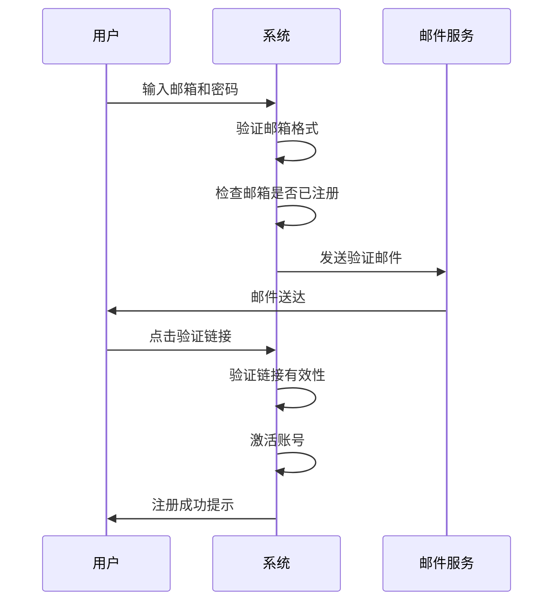

# 校园二手交易网站需求规格说明书

## 文档信息

| 项目名称 | 校园二手交易网站 |
|---------|----------------|
| 文档版本 | v1.0 |
| 编制日期 | 2024年1月 |
| 编制人 | 系统分析师 |
| 文档状态 | 初稿 |

---

## 文档修订历史

| 版本号 | 修订日期 | 修订人 | 修订说明 |
|--------|----------|--------|----------|
| v1.0 | 2024-01 | 系统分析师 | 初稿创建 |

---

## 目录

1. [引言](#1-引言)
2. [总体描述](#2-总体描述)
3. [功能性需求](#3-功能性需求)
4. [非功能性需求](#4-非功能性需求)
5. [数据需求](#5-数据需求)
6. [接口需求](#6-接口需求)
7. [用户界面需求](#7-用户界面需求)
8. [系统架构](#8-系统架构)
9. [验收标准](#9-验收标准)
10. [项目计划](#10-项目计划)
11. [风险评估](#11-风险评估)
12. [附录](#12-附录)

---

## 1. 引言

### 1.1 项目背景

随着校园生活的丰富多样，大学生群体中积累了大量闲置物品，包括教材书籍、电子设备、生活用品、体育器材等。这些物品往往具有较高的剩余使用价值，但由于缺乏有效的交易平台，导致资源浪费严重。

#### 1.1.1 现状问题分析

传统的校园二手交易方式主要存在以下问题：

| 问题类型 | 具体表现 | 影响程度 |
|---------|---------|---------|
| 信息传播受限 | 主要依靠朋友圈、QQ群、微信群等，覆盖面窄 | 高 |
| 信息不对称 | 交易双方信息不透明，信任度低 | 高 |
| 缺乏规范 | 无统一交易规范和纠纷处理机制 | 中 |
| 分类混乱 | 物品分类不清晰，查找效率低 | 中 |
| 安全隐患 | 缺乏身份验证，存在交易风险 | 高 |

#### 1.1.2 项目必要性

开发一个专门面向在校大学生的校园二手交易平台，能够：
- 有效促进校园内资源循环利用
- 降低学生生活成本
- 建立诚信、便捷的交易环境
- 推动绿色环保理念在校园的传播

### 1.2 项目目标

#### 1.2.1 业务目标

| 目标类型 | 具体目标 | 衡量指标 |
|---------|---------|---------|
| 用户规模 | 平台注册用户达到在校学生数的30% | 注册用户数 |
| 交易活跃度 | 月活跃用户占比≥40% | MAU/总用户数 |
| 交易成功率 | 商品发布后成交率≥20% | 成交商品数/发布商品数 |
| 用户满意度 | 用户满意度评分≥4.0分（5分制） | 用户评价 |

#### 1.2.2 技术目标

- 构建可扩展、高可用的Web应用系统
- 实现前后端分离的现代化架构
- 确保系统安全性和数据隐私保护
- 提供良好的用户体验和响应速度

#### 1.2.3 社会目标

- 推动绿色环保理念，减少资源浪费
- 培养学生节约意识和环保意识
- 促进校园内循环经济发展

### 1.3 项目范围

#### 1.3.1 功能范围界定

**范围内功能（In-Scope）：**

| 功能模块 | 功能描述 | 优先级 |
|---------|---------|--------|
| 用户管理 | 用户注册、登录、信息管理、实名认证 | 高 |
| 商品管理 | 商品发布、浏览、搜索、编辑、删除 | 高 |
| 交易沟通 | 站内消息、消息通知 | 高 |
| 订单管理 | 订单创建、处理、完成、评价 | 高 |
| 收藏关注 | 商品收藏、卖家关注 | 中 |
| 管理后台 | 用户管理、商品审核、数据统计 | 高 |
| 首页展示 | 轮播图、分类、推荐商品、公告 | 高 |

**范围外功能（Out-of-Scope）：**

| 功能 | 排除原因 | 替代方案 |
|------|---------|---------|
| 在线支付 | 风险控制复杂，开发成本高 | 线下自行交易 |
| 商品物流 | 需对接物流系统，成本高 | 面交或自行邮寄 |
| 商品质量担保 | 需要专业鉴定团队 | 平台仅提供信息展示 |
| 第三方商家入驻 | 定位于校园C2C交易 | 仅限学生个人交易 |
| 拍卖功能 | 交易场景复杂 | 采用固定价格交易 |
| 租赁功能 | 业务逻辑复杂 | 仅支持二手买卖 |

#### 1.3.2 用户范围

**目标用户：**
- 在校大学生（本科生、研究生、博士生）
- 用户年龄范围：18-30岁
- 用户特征：熟悉互联网操作，追求性价比

**非目标用户：**
- 教职工
- 校外人员
- 商家/企业用户

#### 1.3.3 地域范围

- 主要服务于单一校园或同一城市内的多校区
- 支持同城跨校区交易
- 暂不支持跨城市交易

### 1.4 术语与缩略语

| 术语/缩略语 | 定义 | 说明 |
|------------|------|------|
| 用户 | 在平台注册的在校学生 | 通过校园邮箱验证身份 |
| 卖家 | 发布商品出售信息的用户 | 需完成实名认证 |
| 买家 | 浏览并有意购买商品的用户 | 所有注册用户 |
| 商品 | 用户在平台上发布的待售二手物品 | 包括实物商品 |
| 订单 | 买卖双方达成的交易约定记录 | 记录交易过程 |
| 站内信 | 平台内部的消息沟通系统 | 不涉及外部通讯 |
| 管理员 | 负责平台日常运营管理的人员 | 具有管理权限 |
| C2C | Consumer to Consumer | 消费者对消费者的交易模式 |
| MAU | Monthly Active Users | 月活跃用户数 |
| DAU | Daily Active Users | 日活跃用户数 |
| API | Application Programming Interface | 应用程序编程接口 |
| JWT | JSON Web Token | 用于身份验证的令牌 |

### 1.5 参考资料

| 文档名称 | 版本 | 发布机构 | 用途 |
|---------|------|---------|------|
| IEEE 830-1998 | - | IEEE | 软件需求规格说明推荐实践 |
| ISO/IEC 29148:2011 | - | ISO/IEC | 系统和软件工程需求工程 |
| GB/T 8567-2006 | - | 国家标准委 | 计算机软件文档编制规范 |
| 软件需求规格说明书编写指南 | v2.0 | 项目组 | 内部编写规范 |

### 1.6 需求优先级定义

| 优先级 | 定义 | 说明 |
|--------|------|------|
| 高（High） | 必须实现 | 核心功能，缺失将影响系统基本运行 |
| 中（Medium） | 应该实现 | 重要功能，提升用户体验 |
| 低（Low） | 可以实现 | 锦上添花的功能，可在后续版本实现 |

---

## 2. 总体描述

### 2.1 产品前景

校园二手交易网站是一个面向在校大学生的C2C（Consumer to Consumer）二手物品交易平台。平台通过校园邮箱验证确保用户身份真实性，为买卖双方提供一个安全、可信的交易环境。

#### 2.1.1 产品定位

- **定位**：校园专属二手物品交易平台
- **特色**：身份可信、交易安全、操作便捷
- **价值**：促进校园资源循环利用，降低学生生活成本

#### 2.1.2 产品愿景

成为最受大学生信赖的校园二手交易平台，推动绿色校园建设。

### 2.2 用户特征

#### 2.2.1 用户角色模型

**角色一：买家**

| 特征项 | 描述 |
|--------|------|
| 基本信息 | 在校大学生，年龄18-30岁 |
| 技术能力 | 熟悉互联网操作，会使用移动应用 |
| 使用动机 | 寻找性价比高的二手物品，降低生活成本 |
| 使用场景 | 浏览商品、搜索筛选、联系卖家、下单购买 |
| 痛点需求 | 商品信息真实、价格合理、交易安全 |
| 期望 | 快速找到所需物品，便捷完成交易 |

**角色二：卖家**

| 特征项 | 描述 |
|--------|------|
| 基本信息 | 在校大学生，有闲置物品需要出售 |
| 技术能力 | 会使用手机拍照、上传图片 |
| 使用动机 | 处理闲置物品，获得一定经济回报 |
| 使用场景 | 发布商品、管理商品、回复咨询、处理订单 |
| 痛点需求 | 快速找到买家、交易过程顺畅 |
| 期望 | 商品快速售出，交易过程省心 |

**角色三：管理员**

| 特征项 | 描述 |
|--------|------|
| 基本信息 | 平台运营人员，可能是学生团队或学校工作人员 |
| 技术能力 | 熟悉平台运营，具备基本管理能力 |
| 使用动机 | 维护平台秩序，保障用户权益 |
| 使用场景 | 用户管理、商品审核、纠纷处理、数据统计 |
| 痛点需求 | 高效处理违规内容，及时响应用户投诉 |
| 期望 | 平台运营顺畅，用户满意度高 |

#### 2.2.2 用户画像

**典型用户画像1：小明（买家）**

```
姓名：小明
年龄：20岁
身份：大二学生
专业：计算机科学
需求：购买二手教材和电子设备
行为特征：
- 经常浏览平台寻找优惠商品
- 注重商品成色和价格
- 希望能快速联系到卖家
- 倾向于面交，避免物流成本
```

**典型用户画像2：小红（卖家）**

```
姓名：小红
年龄：22岁
身份：大四学生
专业：工商管理
需求：毕业前出售闲置物品
行为特征：
- 有较多闲置物品需要处理
- 希望快速售出，价格合理即可
- 会主动回复买家咨询
- 希望平台操作简单便捷
```

### 2.3 运行环境

#### 2.3.1 客户端环境

| 环境类型 | 具体要求 | 备注 |
|---------|---------|------|
| **浏览器** | Chrome 80+、Firefox 75+、Safari 13+、Edge 80+ | 推荐使用最新版本 |
| **移动端** | iOS 12+、Android 8.0+ | 支持响应式布局 |
| **屏幕分辨率** | 最小宽度320px | 适配主流设备 |
| **网络** | 稳定的互联网连接 | 建议WiFi或4G网络 |

#### 2.3.2 服务端环境

| 环境类型 | 具体要求 | 备注 |
|---------|---------|------|
| **操作系统** | Linux (Ubuntu 20.04 LTS) | 或其他Linux发行版 |
| **Web服务器** | Nginx 1.18+ | 用于反向代理和静态资源 |
| **运行环境** | Node.js 18+ 或 Python 3.10+ | 根据技术选型确定 |
| **数据库** | MySQL 8.0+ | 主数据库 |
| **缓存** | Redis 6.0+ | 会话管理和缓存 |
| **文件存储** | 本地存储或云存储（OSS/S3） | 图片和文件存储 |

#### 2.3.3 开发环境

| 工具类型 | 推荐工具 | 用途 |
|---------|---------|------|
| **IDE** | VS Code、WebStorm | 代码编辑 |
| **版本控制** | Git | 代码管理 |
| **包管理** | npm/yarn/pnpm | 依赖管理 |
| **API测试** | Postman、Apifox | 接口测试 |
| **数据库工具** | Navicat、DBeaver | 数据库管理 |

### 2.4 设计约束

#### 2.4.1 技术约束

| 约束类型 | 约束内容 | 原因 |
|---------|---------|------|
| 前端框架 | 采用Vue 3 + TypeScript | 团队技术栈、生态完善 |
| 后端框架 | Node.js/Express 或 Python/FastAPI | 开发效率高、易于维护 |
| 数据库 | MySQL | 关系型数据、事务支持 |
| 安全协议 | 必须支持HTTPS | 数据传输安全 |

#### 2.4.2 时间约束

| 阶段 | 时间周期 | 交付物 |
|------|---------|--------|
| 需求分析 | 2周 | 需求规格说明书 |
| 系统设计 | 2周 | 设计文档 |
| 前端开发 | 4周 | 前端代码 |
| 后端开发 | 4周 | 后端代码 |
| 测试部署 | 1周 | 测试报告、部署文档 |
| **总计** | **13周** | **完整系统** |

#### 2.4.3 资源约束

- 开发团队规模：3-5人
- 服务器资源：初期可使用云服务器最低配置
- 预算：学生项目，成本控制在最低

#### 2.4.4 合规约束

- 遵守《网络安全法》相关规定
- 用户数据隐私保护符合《个人信息保护法》
- 平台内容审核符合互联网信息服务管理规定

### 2.5 假设与依赖

#### 2.5.1 假设条件

| 编号 | 假设内容 | 验证方法 |
|------|---------|---------|
| A-001 | 学校提供校园邮箱验证接口或允许使用邮箱后缀验证 | 与学校IT部门确认 |
| A-002 | 学生具备基本的互联网操作能力 | 用户调研 |
| A-003 | 学校允许此类交易平台在校园内运营 | 与学校相关部门沟通 |
| A-004 | 学生对二手交易有实际需求 | 问卷调查 |
| A-005 | 用户愿意提供真实身份信息进行认证 | 用户访谈 |

#### 2.5.2 依赖条件

| 编号 | 依赖内容 | 风险等级 | 应对措施 |
|------|---------|---------|---------|
| D-001 | 校园网络基础设施稳定运行 | 中 | 优化系统性能，减少网络依赖 |
| D-002 | 第三方云存储服务可用性（如使用） | 低 | 可使用本地存储替代 |
| D-003 | 短信/邮件服务提供商可用性（如使用） | 中 | 选择可靠的服务商 |
| D-004 | 开发团队成员稳定性 | 中 | 做好知识沉淀和文档管理 |

---

## 3. 功能性需求

### 3.1 用户管理模块

#### 3.1.1 用户注册

**需求ID：** FR-UM-001

**需求名称：** 用户注册

**优先级：** 高

**需求描述：**
用户必须通过校园邮箱进行注册，系统验证邮箱有效性后方可完成注册。注册流程确保用户身份的真实性。

**做什么（Must-have）：**
- 提供校园邮箱注册入口
- 验证邮箱格式（必须为学校官方邮箱后缀）
- 发送验证邮件并验证用户点击链接
- 创建用户账号并设置初始状态

**不做什么（Out-of-scope）：**
- 不支持非校园邮箱注册
- 不支持第三方账号（微信、QQ等）直接登录
- 不支持手机号直接注册（可作为后续绑定）

**验收标准（Definition of Done）：**

| 验收项 | 验收标准 | 测试方法 |
|--------|---------|---------|
| 功能验收 | 用户可使用有效校园邮箱完成注册 | 功能测试 |
| 邮箱验证 | 系统正确验证邮箱后缀是否为学校官方邮箱 | 边界测试 |
| 邮件送达 | 验证邮件在5分钟内送达 | 性能测试 |
| 安全验收 | 密码加密存储，验证链接有效期24小时 | 安全测试 |
| 异常处理 | 邮箱已注册、格式错误等情况有明确提示 | 异常测试 |

**前置条件：** 用户未注册过账号

**后置条件：** 用户账号创建成功，状态为待认证

**输入：**
- 邮箱地址（必填）
- 密码（必填，8-20位，包含字母和数字）
- 确认密码（必填）

**处理流程：**



**输出：** 注册成功/失败提示

**异常处理：**

| 异常情况 | 错误码 | 提示信息 | 处理方式 |
|---------|--------|---------|---------|
| 邮箱已被注册 | E001 | "该邮箱已注册，请直接登录" | 引导用户登录 |
| 邮箱格式错误 | E002 | "请使用学校官方邮箱（xxx@edu.cn）" | 提示正确格式 |
| 邮件发送失败 | E003 | "邮件发送失败，请稍后重试" | 允许重新发送 |
| 验证链接过期 | E004 | "验证链接已过期，请重新注册" | 引导重新注册 |
| 密码强度不足 | E005 | "密码需8-20位，包含字母和数字" | 提示密码规则 |

**业务规则：**
- BR-001：邮箱后缀必须为学校官方邮箱域名
- BR-002：密码必须加密存储（使用bcrypt或argon2）
- BR-003：验证链接有效期为24小时
- BR-004：同一邮箱只能注册一个账号

---

#### 3.1.2 用户登录

**需求ID：** FR-UM-002

**需求名称：** 用户登录

**优先级：** 高

**需求描述：**
已注册用户可通过邮箱和密码登录系统，系统验证用户身份后授予访问权限。

**做什么（Must-have）：**
- 提供邮箱+密码登录方式
- 验证用户凭证的正确性
- 创建用户会话，返回认证令牌
- 记录登录日志

**不做什么（Out-of-scope）：**
- 不支持手机号登录（除非已绑定）
- 不支持第三方账号登录
- 不支持短信验证码登录

**验收标准：**

| 验收项 | 验收标准 | 测试方法 |
|--------|---------|---------|
| 功能验收 | 正确凭证可成功登录 | 功能测试 |
| 安全验收 | 连续5次密码错误，账号锁定30分钟 | 安全测试 |
| 性能验收 | 登录响应时间≤500ms | 性能测试 |
| 会话管理 | 登录状态保持7天（可配置） | 功能测试 |

**前置条件：** 用户已完成注册并通过邮箱验证

**后置条件：** 用户成功登录，获得访问权限

**输入：**
- 邮箱地址（必填）
- 密码（必填）
- 记住我（可选）

**处理流程：**

1. 用户输入邮箱和密码
2. 系统验证邮箱和密码
3. 检查账号状态（是否被封禁）
4. 验证通过，创建会话（JWT Token）
5. 记录登录日志（IP、时间、设备）
6. 跳转到首页

**输出：** 登录成功/失败提示

**异常处理：**

| 异常情况 | 错误码 | 提示信息 | 处理方式 |
|---------|--------|---------|---------|
| 账号不存在 | E101 | "账号不存在" | 引导注册 |
| 密码错误 | E102 | "密码错误，还剩X次机会" | 记录错误次数 |
| 账号被冻结 | E103 | "账号已被冻结，请联系管理员" | 引导联系客服 |
| 账号未验证 | E104 | "账号未验证，请查收验证邮件" | 引导验证 |

**业务规则：**
- BR-101：连续5次密码错误，账号锁定30分钟
- BR-102：登录令牌有效期7天（勾选"记住我"）
- BR-103：登录令牌有效期2小时（未勾选"记住我"）

---

#### 3.1.3 密码找回

**需求ID：** FR-UM-003

**需求名称：** 密码找回

**优先级：** 高

**需求描述：**
用户忘记密码时可通过注册邮箱重置密码，确保账号安全。

**做什么（Must-have）：**
- 提供密码找回入口
- 通过注册邮箱发送重置链接
- 验证重置链接有效性
- 允许用户设置新密码

**不做什么（Out-of-scope）：**
- 不支持手机短信找回
- 不支持安全问题找回
- 不支持管理员直接重置密码

**验收标准：**

| 验收项 | 验收标准 | 测试方法 |
|--------|---------|---------|
| 功能验收 | 用户可通过邮箱重置密码 | 功能测试 |
| 安全验收 | 重置链接有效期2小时 | 安全测试 |
| 密码强度 | 新密码需符合密码强度要求 | 边界测试 |

**前置条件：** 用户已完成注册

**后置条件：** 用户密码重置成功

**输入：**
- 注册邮箱（必填）
- 新密码（必填）
- 确认新密码（必填）

**处理流程：**

1. 用户输入注册邮箱
2. 系统验证邮箱是否存在
3. 发送重置密码邮件
4. 用户点击邮件链接
5. 验证链接有效性
6. 用户设置新密码
7. 密码重置成功

**输出：** 重置成功/失败提示

**业务规则：**
- BR-201：重置链接有效期2小时
- BR-202：新密码不能与旧密码相同
- BR-203：重置成功后，原有会话全部失效

---

#### 3.1.4 个人信息管理

**需求ID：** FR-UM-004

**需求名称：** 个人信息管理

**优先级：** 中

**需求描述：**
用户可以查看和修改个人信息，包括头像、昵称、联系方式等，控制个人信息的公开程度。

**做什么（Must-have）：**
- 提供个人信息查看和编辑页面
- 支持修改头像、昵称、联系方式等
- 支持设置联系方式是否公开
- 支持修改密码

**不做什么（Out-of-scope）：**
- 不支持修改注册邮箱
- 不支持修改实名认证信息
- 不支持删除账号（单独功能）

**验收标准：**

| 验收项 | 验收标准 | 测试方法 |
|--------|---------|---------|
| 功能验收 | 信息修改后立即生效 | 功能测试 |
| 头像上传 | 支持jpg、png格式，大小不超过2MB | 边界测试 |
| 联系方式 | 可设置是否公开 | 功能测试 |

**可修改信息：**

| 信息项 | 是否必填 | 是否可公开 | 格式要求 |
|--------|---------|-----------|---------|
| 头像 | 否 | 是 | jpg/png，≤2MB |
| 昵称 | 是 | 是 | 2-20字符 |
| 手机号 | 否 | 可选 | 11位数字 |
| 微信号 | 否 | 可选 | 字母数字组合 |
| QQ号 | 否 | 可选 | 5-12位数字 |
| 所在校区 | 是 | 是 | 下拉选择 |
| 个人简介 | 否 | 是 | ≤200字 |

**业务规则：**
- BR-301：昵称不能包含敏感词
- BR-302：联系方式默认不公开
- BR-303：头像需审核后显示（可选）

---

#### 3.1.5 实名认证

**需求ID：** FR-UM-005

**需求名称：** 实名认证

**优先级：** 高

**需求描述：**
用户必须完成实名认证才能发布商品，认证信息包括真实姓名、学号、学生证照片，确保交易安全。

**做什么（Must-have）：**
- 提供实名认证申请入口
- 收集真实姓名、学号、学生证照片
- 管理员审核认证申请
- 更新用户认证状态

**不做什么（Out-of-scope）：**
- 不对接学校教务系统自动验证
- 不支持身份证认证（仅学生证）
- 不支持外籍学生护照认证（暂不支持）

**验收标准：**

| 验收项 | 验收标准 | 测试方法 |
|--------|---------|---------|
| 功能验收 | 用户可提交认证申请 | 功能测试 |
| 审核时效 | 认证审核在24小时内完成 | 性能测试 |
| 照片要求 | 学生证照片清晰可辨认 | 人工审核 |

**前置条件：** 用户已完成邮箱验证

**后置条件：** 用户认证状态更新

**输入：**
- 真实姓名（必填）
- 学号（必填）
- 学生证照片（必填，需包含照片页和信息页）

**处理流程：**

1. 用户填写真实姓名和学号
2. 上传学生证照片
3. 提交认证申请
4. 管理员审核
5. 审核通过/拒绝
6. 通知用户审核结果

**输出：** 认证成功/失败提示

**业务规则：**
- BR-401：认证审核在24小时内完成
- BR-402：学生证照片需清晰可辨认
- BR-403：学号与姓名需匹配
- BR-404：认证失败可重新申请
- BR-405：认证信息仅用于身份验证，不对外公开

---

#### 3.1.6 账号注销

**需求ID：** FR-UM-006

**需求名称：** 账号注销

**优先级：** 低

**需求描述：**
用户可以申请注销账号，注销后账号数据将被清除，保障用户数据权利。

**做什么（Must-have）：**
- 提供账号注销入口
- 检查是否有进行中的订单
- 清除用户数据
- 通知用户注销结果

**不做什么（Out-of-scope）：**
- 不支持账号冻结功能
- 不支持账号恢复功能
- 不支持部分数据删除

**验收标准：**

| 验收项 | 验收标准 | 测试方法 |
|--------|---------|---------|
| 功能验收 | 注销后无法恢复 | 功能测试 |
| 安全验收 | 注销前需二次确认 | 安全测试 |
| 数据清除 | 用户数据完全清除 | 数据验证 |

**前置条件：** 用户无进行中的订单

**处理流程：**

1. 用户申请注销
2. 系统检查是否有进行中订单
3. 如有订单，提示用户先完成订单
4. 如无订单，显示注销确认
5. 用户确认注销
6. 账号数据清除
7. 发送注销通知邮件

**业务规则：**
- BR-501：注销后无法恢复
- BR-502：注销前需确认无未完成订单
- BR-503：注销后邮箱可重新注册

---

### 3.2 商品管理模块

#### 3.2.1 商品发布

**需求ID：** FR-PM-001

**需求名称：** 商品发布

**优先级：** 高

**需求描述：**
已认证用户可以发布二手商品信息，包括商品标题、描述、价格、分类、成色、图片等，供其他用户浏览和购买。

**做什么（Must-have）：**
- 提供商品发布表单
- 支持上传商品图片（1-5张）
- 支持选择商品分类和成色
- 支持设置价格和交易方式
- 支持商品描述编辑

**不做什么（Out-of-scope）：**
- 不支持视频上传
- 不支持商品拍卖模式
- 不支持商品租赁模式
- 不支持批量上传

**验收标准：**

| 验收项 | 验收标准 | 测试方法 |
|--------|---------|---------|
| 功能验收 | 用户可成功发布商品 | 功能测试 |
| 图片上传 | 支持1-5张图片，单张≤5MB | 边界测试 |
| 内容审核 | 商品信息需审核后上架 | 流程测试 |
| 性能验收 | 发布操作响应时间≤1秒 | 性能测试 |

**前置条件：** 用户已完成实名认证

**后置条件：** 商品创建成功，状态为待审核或已上架

**输入：**

| 字段名 | 是否必填 | 格式要求 | 说明 |
|--------|---------|---------|------|
| 商品标题 | 是 | ≤50字 | 简洁描述商品 |
| 商品描述 | 是 | ≤1000字 | 详细描述商品情况 |
| 商品价格 | 是 | 正数，≤2位小数 | 出售价格 |
| 原价 | 否 | 正数，≤2位小数 | 商品原价（参考） |
| 商品分类 | 是 | 下拉选择 | 从预设分类中选择 |
| 商品成色 | 是 | 下拉选择 | 从成色等级中选择 |
| 商品图片 | 是 | 1-5张，jpg/png | 商品实物照片 |
| 交易方式 | 是 | 多选 | 面交/邮寄 |
| 所在校区 | 是 | 下拉选择 | 商品所在校区 |

**商品分类：**

| 分类ID | 分类名称 | 说明 |
|--------|---------|------|
| 1 | 书籍教材 | 教材、参考书、课外读物等 |
| 2 | 电子数码 | 手机、电脑、平板、相机等 |
| 3 | 生活用品 | 日用品、小家电、装饰品等 |
| 4 | 交通工具 | 自行车、电动车、滑板等 |
| 5 | 体育用品 | 运动器材、健身设备等 |
| 6 | 服饰鞋包 | 衣服、鞋子、包包等 |
| 7 | 美妆护肤 | 化妆品、护肤品等 |
| 8 | 其他 | 不属于以上分类的物品 |

**成色等级：**

| 等级 | 描述 | 折扣参考 |
|------|------|---------|
| 全新 | 未使用过，包装完好 | 80%-90%原价 |
| 99新 | 仅拆封，几乎无使用痕迹 | 70%-80%原价 |
| 95新 | 轻微使用痕迹，功能完好 | 60%-70%原价 |
| 9成新 | 有明显使用痕迹，功能完好 | 50%-60%原价 |
| 8成新 | 使用痕迹明显，功能正常 | 40%-50%原价 |
| 7成新及以下 | 使用痕迹严重，功能基本正常 | 30%-40%原价 |

**处理流程：**

1. 用户点击"发布商品"
2. 填写商品信息
3. 上传商品图片
4. 选择分类、成色、交易方式
5. 设置价格
6. 提交发布
7. 系统审核（可选）
8. 商品上架

**输出：** 发布成功/失败提示

**业务规则：**
- BR-601：商品标题不超过50字
- BR-602：商品描述不超过1000字
- BR-603：图片支持jpg、png格式，单张不超过5MB
- BR-604：价格必须为正数
- BR-605：商品信息需审核后上架（可选）
- BR-606：每个用户同时在线商品数量限制（如50个）

---

#### 3.2.2 商品浏览

**需求ID：** FR-PM-002

**需求名称：** 商品浏览

**优先级：** 高

**需求描述：**
用户可以浏览平台上的商品列表，通过多种方式发现感兴趣的商品。

**做什么（Must-have）：**
- 提供首页推荐商品展示
- 提供分类浏览入口
- 支持分页加载
- 显示商品基本信息

**不做什么（Out-of-scope）：**
- 不支持个性化推荐算法
- 不支持基于用户行为的推荐
- 不支持商品对比功能

**验收标准：**

| 验收项 | 验收标准 | 测试方法 |
|--------|---------|---------|
| 功能验收 | 用户可浏览商品列表 | 功能测试 |
| 性能验收 | 列表加载时间≤1秒 | 性能测试 |
| 分页加载 | 每页显示20条商品 | 功能测试 |

**浏览方式：**

| 浏览方式 | 说明 | 排序规则 |
|---------|------|---------|
| 首页推荐 | 热门商品、最新上架 | 综合热度+时间 |
| 分类浏览 | 按商品分类查看 | 最新发布优先 |
| 搜索浏览 | 关键词搜索结果 | 相关度+时间 |

**列表展示信息：**

| 展示项 | 说明 |
|--------|------|
| 商品缩略图 | 第一张商品图片 |
| 商品标题 | 最多显示20字，超出省略 |
| 商品价格 | 显示售价 |
| 商品成色 | 显示成色等级 |
| 发布时间 | 显示相对时间（如"3小时前"） |
| 卖家昵称 | 显示卖家昵称 |
| 所在校区 | 显示商品所在校区 |

---

#### 3.2.3 商品搜索

**需求ID：** FR-PM-003

**需求名称：** 商品搜索

**优先级：** 高

**需求描述：**
用户可以通过关键词搜索商品，并使用筛选条件缩小搜索范围，快速找到所需商品。

**做什么（Must-have）：**
- 提供搜索输入框
- 支持关键词搜索（标题、描述）
- 提供多种筛选条件
- 支持多种排序方式
- 支持搜索历史记录

**不做什么（Out-of-scope）：**
- 不支持图片搜索
- 不支持语音搜索
- 不支持高级搜索语法

**验收标准：**

| 验收项 | 验收标准 | 测试方法 |
|--------|---------|---------|
| 功能验收 | 搜索结果准确匹配关键词 | 功能测试 |
| 性能验收 | 搜索响应时间≤1秒 | 性能测试 |
| 模糊搜索 | 支持模糊匹配 | 功能测试 |
| 高亮显示 | 搜索结果高亮显示关键词 | UI测试 |

**搜索范围：**
- 商品标题（权重高）
- 商品描述（权重低）

**筛选条件：**

| 筛选项 | 类型 | 说明 |
|--------|------|------|
| 价格区间 | 范围选择 | 最低价-最高价 |
| 商品成色 | 多选 | 选择成色等级 |
| 发布时间 | 单选 | 24小时内、7天内、30天内 |
| 交易方式 | 多选 | 面交、邮寄 |
| 所在校区 | 单选 | 选择校区 |

**排序方式：**

| 排序方式 | 说明 |
|---------|------|
| 综合排序（默认） | 综合考虑相关度、时间、热度 |
| 价格从低到高 | 按价格升序 |
| 价格从高到低 | 按价格降序 |
| 最新发布 | 按发布时间降序 |
| 浏览量最高 | 按浏览量降序 |

**业务规则：**
- BR-701：搜索关键词长度2-50字
- BR-702：搜索结果最多显示1000条
- BR-703：搜索历史保存最近10条

---

#### 3.2.4 商品详情

**需求ID：** FR-PM-004

**需求名称：** 商品详情

**优先级：** 高

**需求描述：**
用户可以查看商品的详细信息，包括商品图片、描述、价格、卖家信息等，并可以进行收藏、联系卖家等操作。

**做什么（Must-have）：**
- 展示商品完整信息
- 支持图片轮播和放大查看
- 显示卖家基本信息
- 提供收藏、联系卖家、举报等操作

**不做什么（Out-of-scope）：**
- 不显示卖家敏感信息（手机号等，除非授权）
- 不支持商品分享到社交平台（后续版本）
- 不支持商品评价（订单完成后评价）

**验收标准：**

| 验收项 | 验收标准 | 测试方法 |
|--------|---------|---------|
| 功能验收 | 商品信息完整展示 | 功能测试 |
| 图片查看 | 支持点击放大、轮播 | UI测试 |
| 操作功能 | 收藏、联系卖家功能正常 | 功能测试 |

**展示内容：**

| 内容项 | 说明 |
|--------|------|
| 商品图片 | 支持轮播，最多5张 |
| 商品标题 | 完整标题 |
| 商品价格 | 售价，可显示原价对比 |
| 商品成色 | 成色等级 |
| 商品描述 | 详细描述 |
| 发布时间 | 具体时间 |
| 浏览次数 | 累计浏览次数 |
| 收藏次数 | 累计收藏次数 |
| 卖家信息 | 昵称、头像、信用评分、所在校区 |
| 交易方式 | 面交/邮寄 |
| 所在校区 | 商品所在校区 |

**操作按钮：**

| 操作 | 说明 |
|------|------|
| 收藏商品 | 收藏到个人收藏夹 |
| 联系卖家 | 打开站内消息对话 |
| 举报商品 | 举报违规商品 |
| 立即购买 | 创建订单（需登录） |

**业务规则：**
- BR-801：卖家联系方式需卖家授权公开
- BR-802：浏览次数每次访问+1（同一用户24小时内只计1次）
- BR-803：商品下架后仍可查看详情，但标注"已下架"

---

#### 3.2.5 商品管理

**需求ID：** FR-PM-005

**需求名称：** 商品管理

**优先级：** 高

**需求描述：**
卖家可以管理已发布的商品，包括编辑商品信息、上架/下架商品、删除商品、标记已售出等操作。

**做什么（Must-have）：**
- 提供商品管理列表
- 支持编辑商品信息
- 支持上架/下架操作
- 支持删除商品
- 支持标记已售出

**不做什么（Out-of-scope）：**
- 不支持批量操作（后续版本）
- 不支持商品数据导出
- 不支持商品数据统计

**验收标准：**

| 验收项 | 验收标准 | 测试方法 |
|--------|---------|---------|
| 功能验收 | 管理功能正常使用 | 功能测试 |
| 编辑限制 | 编辑后商品需重新审核 | 流程测试 |
| 状态管理 | 商品状态正确切换 | 功能测试 |

**管理功能：**

| 功能 | 说明 |
|------|------|
| 编辑商品 | 修改商品信息，需重新审核 |
| 上架商品 | 下架商品重新上架 |
| 下架商品 | 暂时下架，可重新上架 |
| 删除商品 | 永久删除商品 |
| 标记已售出 | 标记商品已售出，不可再上架 |

**商品状态流转：**

```
待审核 → 已上架 → 已下架 → 已上架
                ↓
            已售出
                ↓
              已删除
```

**业务规则：**
- BR-901：编辑后商品需重新审核
- BR-902：已售出商品不可再次上架
- BR-903：删除商品不可恢复
- BR-904：商品下架后收藏列表中仍保留，但标注"已下架"

---

### 3.3 交易沟通模块

#### 3.3.1 站内消息

**需求ID：** FR-TC-001

**需求名称：** 站内消息

**优先级：** 高

**需求描述：**
买卖双方可以通过站内消息进行沟通，协商交易细节，系统记录完整的沟通历史。

**做什么（Must-have）：**
- 提供站内消息发送功能
- 支持消息历史记录查看
- 显示消息已读/未读状态
- 提供消息提醒

**不做什么（Out-of-scope）：**
- 不支持发送图片（后续版本）
- 不支持发送文件
- 不支持语音消息
- 不支持消息撤回（后续版本）

**验收标准：**

| 验收项 | 验收标准 | 测试方法 |
|--------|---------|---------|
| 功能验收 | 消息实时送达 | 功能测试 |
| 消息记录 | 历史消息完整保存 | 数据验证 |
| 已读状态 | 已读/未读状态准确显示 | 功能测试 |

**功能描述：**

| 功能 | 说明 |
|------|------|
| 发送消息 | 发送文字消息，长度≤500字 |
| 消息列表 | 按对话分组，显示最新消息 |
| 消息详情 | 显示完整对话历史 |
| 未读提示 | 显示未读消息数量 |
| 消息搜索 | 搜索历史消息（后续版本） |

**消息列表展示：**

| 展示项 | 说明 |
|--------|------|
| 对方头像 | 聊天对象头像 |
| 对方昵称 | 聊天对象昵称 |
| 最新消息 | 最新一条消息内容（截断） |
| 消息时间 | 最新消息时间 |
| 未读数量 | 未读消息数量角标 |

**业务规则：**
- BR-1001：消息长度≤500字
- BR-1002：消息永久保存
- BR-1003：支持消息撤回（2分钟内，后续版本）
- BR-1004：被拉黑用户无法发送消息

---

#### 3.3.2 消息通知

**需求ID：** FR-TC-002

**需求名称：** 消息通知

**优先级：** 中

**需求描述：**
用户收到新消息、订单状态变更等事件时获得通知提醒，确保用户及时了解重要信息。

**做什么（Must-have）：**
- 提供站内通知功能
- 支持邮件通知（可选）
- 支持浏览器推送（可选）
- 用户可设置通知偏好

**不做什么（Out-of-scope）：**
- 不支持短信通知（成本考虑）
- 不支持微信推送
- 不支持电话通知

**验收标准：**

| 验收项 | 验收标准 | 测试方法 |
|--------|---------|---------|
| 功能验收 | 通知及时送达 | 功能测试 |
| 偏好设置 | 用户可自定义通知方式 | 功能测试 |
| 性能验收 | 通知延迟≤5秒 | 性能测试 |

**通知方式：**

| 通知方式 | 说明 | 默认开启 |
|---------|------|---------|
| 站内通知 | 平台内消息提醒 | 是 |
| 邮件通知 | 发送邮件提醒 | 否 |
| 浏览器推送 | 浏览器推送通知 | 否 |

**通知场景：**

| 场景 | 通知内容 | 通知方式 |
|------|---------|---------|
| 收到新消息 | "您有新的消息" | 站内+邮件+推送 |
| 订单状态变更 | "您的订单状态已更新" | 站内+邮件 |
| 商品被收藏 | "您的商品被收藏了" | 站内 |
| 关注卖家发布新商品 | "您关注的卖家发布了新商品" | 站内+推送 |
| 认证审核结果 | "您的认证申请已审核" | 站内+邮件 |

**业务规则：**
- BR-1101：用户可设置通知偏好
- BR-1102：站内通知永久保存
- BR-1103：邮件通知可退订

---

#### 3.3.3 举报功能

**需求ID：** FR-TC-003

**需求名称：** 举报功能

**优先级：** 中

**需求描述：**
用户可以举报违规商品或消息，维护平台交易秩序，保护用户权益。

**做什么（Must-have）：**
- 提供举报入口
- 支持多种举报类型
- 管理员处理举报
- 通知举报人处理结果

**不做什么（Out-of-scope）：**
- 不支持匿名举报（需登录）
- 不支持举报进度查询（后续版本）
- 不支持举报奖励机制

**验收标准：**

| 验收项 | 验收标准 | 测试方法 |
|--------|---------|---------|
| 功能验收 | 用户可提交举报 | 功能测试 |
| 处理时效 | 举报后24小时内响应 | 性能测试 |
| 隐私保护 | 举报人信息保密 | 安全测试 |

**举报类型：**

| 类型 | 说明 | 处理优先级 |
|------|------|-----------|
| 虚假信息 | 商品信息与实际不符 | 高 |
| 欺诈行为 | 存在欺诈嫌疑 | 高 |
| 违禁物品 | 发布违禁商品 | 高 |
| 骚扰消息 | 发送骚扰消息 | 中 |
| 其他违规 | 其他违规行为 | 中 |

**处理流程：**

1. 用户提交举报
2. 系统记录举报信息
3. 管理员审核
4. 核实举报内容
5. 做出处理决定
6. 通知举报人和被举报人

**业务规则：**
- BR-1201：举报后24小时内响应
- BR-1202：举报人信息保密
- BR-1203：恶意举报将受到处罚

---

### 3.4 订单管理模块

#### 3.4.1 创建订单

**需求ID：** FR-OM-001

**需求名称：** 创建订单

**优先级：** 高

**需求描述：**
买家可以向卖家发起购买请求，创建交易订单，记录交易双方信息和商品信息。

**做什么（Must-have）：**
- 提供创建订单入口
- 收集买家留言和联系方式
- 创建订单记录
- 更新商品状态

**不做什么（Out-of-scope）：**
- 不支持购物车功能
- 不支持批量下单
- 不支持订单修改

**验收标准：**

| 验收项 | 验收标准 | 测试方法 |
|--------|---------|---------|
| 功能验收 | 订单创建成功 | 功能测试 |
| 唯一性 | 一个商品同时只能有一个进行中的订单 | 业务规则测试 |
| 状态更新 | 订单创建后商品状态变更为"交易中" | 功能测试 |

**前置条件：** 商品状态为已上架

**输入：**

| 字段名 | 是否必填 | 说明 |
|--------|---------|------|
| 商品ID | 是 | 关联商品 |
| 买家留言 | 否 | 给卖家的留言，≤200字 |
| 联系方式 | 是 | 买家联系方式 |

**处理流程：**

1. 买家点击"立即购买"
2. 填写留言和联系方式
3. 提交购买请求
4. 系统检查商品状态
5. 创建订单记录
6. 更新商品状态为"交易中"
7. 通知卖家

**输出：** 订单创建成功提示

**业务规则：**
- BR-1301：一个商品同时只能有一个进行中的订单
- BR-1302：订单创建后商品状态变更为"交易中"
- BR-1303：买家不能购买自己发布的商品

---

#### 3.4.2 订单处理

**需求ID：** FR-OM-002

**需求名称：** 订单处理

**优先级：** 高

**需求描述：**
卖家可以接受或拒绝购买请求，确认交易意向，推进订单流程。

**做什么（Must-have）：**
- 提供订单确认入口
- 支持接受/拒绝订单
- 更新订单状态
- 通知买家处理结果

**不做什么（Out-of-scope）：**
- 不支持议价功能
- 不支持订单转让
- 不支持部分交易

**验收标准：**

| 验收项 | 验收标准 | 测试方法 |
|--------|---------|---------|
| 功能验收 | 卖家可接受/拒绝订单 | 功能测试 |
| 响应时效 | 卖家应在24小时内响应 | 业务规则测试 |
| 超时处理 | 超时未响应自动取消 | 功能测试 |

**订单状态：**

| 状态 | 说明 | 可转换状态 |
|------|------|-----------|
| 待确认 | 等待卖家确认 | 已确认、已取消 |
| 已确认 | 卖家已接受，等待交易 | 已完成、已取消 |
| 已完成 | 交易完成 | - |
| 已取消 | 订单取消 | - |

**处理流程：**

**卖家确认：**
1. 卖家查看订单详情
2. 确认接受或拒绝
3. 状态变更
4. 通知买家

**卖家拒绝：**
1. 卖家填写拒绝原因
2. 订单取消
3. 商品恢复上架
4. 通知买家

**业务规则：**
- BR-1401：卖家应在24小时内响应
- BR-1402：超时未响应自动取消
- BR-1403：拒绝订单需填写原因
- BR-1404：订单取消后商品恢复上架

---

#### 3.4.3 订单完成

**需求ID：** FR-OM-003

**需求名称：** 订单完成

**优先级：** 高

**需求描述：**
交易完成后确认订单完成，记录交易结果，更新商品状态。

**做什么（Must-have）：**
- 提供订单完成确认入口
- 卖家确认发货/面交完成
- 买家确认收货
- 更新订单和商品状态

**不做什么（Out-of-scope）：**
- 不支持自动确认收货（除超时外）
- 不支持延长收货时间
- 不支持退货退款流程

**验收标准：**

| 验收项 | 验收标准 | 测试方法 |
|--------|---------|---------|
| 功能验收 | 订单可正常完成 | 功能测试 |
| 自动完成 | 买家超时未确认，7天后自动完成 | 业务规则测试 |
| 状态更新 | 订单完成后商品状态更新为"已售出" | 功能测试 |

**处理流程：**

1. 买卖双方线下完成交易
2. 卖家确认发货/面交完成
3. 买家确认收货
4. 订单完成
5. 商品状态更新为"已售出"

**业务规则：**
- BR-1501：买家确认后订单完成
- BR-1502：买家超时未确认，7天后自动完成
- BR-1503：订单完成后商品状态更新为"已售出"

---

#### 3.4.4 订单评价

**需求ID：** FR-OM-004

**需求名称：** 订单评价

**优先级：** 中

**需求描述：**
交易完成后买家可以对卖家进行评价，建立信用体系，帮助其他用户判断卖家信誉。

**做什么（Must-have）：**
- 提供评价入口
- 支持评分（1-5星）
- 支持评价文字
- 展示评价信息

**不做什么（Out-of-scope）：**
- 不支持卖家评价买家
- 不支持评价修改
- 不支持评价删除
- 不支持追评

**验收标准：**

| 验收项 | 验收标准 | 测试方法 |
|--------|---------|---------|
| 功能验收 | 买家可提交评价 | 功能测试 |
| 唯一性 | 每个订单只能评价一次 | 业务规则测试 |
| 展示 | 评价在卖家主页展示 | UI测试 |

**评价内容：**

| 内容项 | 说明 |
|--------|------|
| 评分 | 1-5星，必填 |
| 评价文字 | ≤200字，可选 |

**评价展示：**

| 展示位置 | 展示内容 |
|---------|---------|
| 卖家主页 | 平均评分、评价数量、最新评价 |
| 商品详情 | 卖家评分 |
| 订单详情 | 评价内容 |

**业务规则：**
- BR-1601：每个订单只能评价一次
- BR-1602：评价后不可修改
- BR-1603：评价需在订单完成后7天内提交
- BR-1604：评价内容需审核（可选）

---

#### 3.4.5 订单历史

**需求ID：** FR-OM-005

**需求名称：** 订单历史

**优先级：** 高

**需求描述：**
用户可以查看自己的购买和销售订单历史，了解交易记录。

**做什么（Must-have）：**
- 提供订单列表查看
- 按状态分组展示
- 提供订单详情查看
- 支持筛选和排序

**不做什么（Out-of-scope）：**
- 不支持订单数据导出
- 不支持订单数据统计
- 不支持订单删除

**验收标准：**

| 验收项 | 验收标准 | 测试方法 |
|--------|---------|---------|
| 功能验收 | 订单列表正常显示 | 功能测试 |
| 数据完整性 | 订单记录永久保存 | 数据验证 |
| 筛选功能 | 筛选条件正常工作 | 功能测试 |

**查看内容：**

| 内容项 | 说明 |
|--------|------|
| 订单列表 | 按状态分组（待处理、进行中、已完成、已取消） |
| 订单详情 | 商品信息、交易对方信息、订单状态、时间线 |
| 交易对方 | 昵称、头像、联系方式 |

**筛选条件：**

| 筛选项 | 说明 |
|--------|------|
| 订单状态 | 按状态筛选 |
| 时间范围 | 按时间范围筛选 |

**业务规则：**
- BR-1701：订单记录永久保存
- BR-1702：支持按时间倒序排列
- BR-1703：已取消订单保留30天后归档

---

### 3.5 收藏与关注模块

#### 3.5.1 商品收藏

**需求ID：** FR-FV-001

**需求名称：** 商品收藏

**优先级：** 高

**需求描述：**
用户可以收藏感兴趣的商品，方便后续查看和比较。

**做什么（Must-have）：**
- 提供收藏/取消收藏功能
- 提供收藏列表查看
- 支持批量删除收藏
- 商品状态变更时提示

**不做什么（Out-of-scope）：**
- 不支持收藏夹分类
- 不支持收藏夹分享
- 不支持收藏夹导出

**验收标准：**

| 验收项 | 验收标准 | 测试方法 |
|--------|---------|---------|
| 功能验收 | 收藏功能正常 | 功能测试 |
| 数量限制 | 收藏数量无上限 | 边界测试 |
| 分页加载 | 收藏列表支持分页 | 功能测试 |

**功能描述：**

| 功能 | 说明 |
|------|------|
| 收藏商品 | 点击收藏按钮，添加到收藏列表 |
| 取消收藏 | 再次点击，从收藏列表移除 |
| 查看收藏 | 查看收藏的商品列表 |
| 批量删除 | 批量删除收藏的商品 |

**业务规则：**
- BR-1801：收藏数量无上限
- BR-1802：收藏列表支持分页（每页20条）
- BR-1803：商品下架/售出时在收藏列表中标注
- BR-1804：商品降价时通知收藏用户（后续版本）

---

#### 3.5.2 卖家关注

**需求ID：** FR-FV-002

**需求名称：** 卖家关注

**优先级：** 中

**需求描述：**
用户可以关注感兴趣的卖家，及时获取卖家发布的新商品信息。

**做什么（Must-have）：**
- 提供关注/取消关注功能
- 提供关注列表查看
- 关注卖家发布新商品时收到通知

**不做什么（Out-of-scope）：**
- 不支持关注分组
- 不支持关注推荐
- 不支持粉丝管理

**验收标准：**

| 验收项 | 验收标准 | 测试方法 |
|--------|---------|---------|
| 功能验收 | 关注功能正常 | 功能测试 |
| 数量限制 | 关注数量无上限 | 边界测试 |
| 通知及时 | 新商品发布后即时通知 | 性能测试 |

**功能描述：**

| 功能 | 说明 |
|------|------|
| 关注卖家 | 点击关注按钮，添加到关注列表 |
| 取消关注 | 再次点击，从关注列表移除 |
| 查看关注 | 查看关注的卖家列表 |
| 新品通知 | 关注卖家发布新商品时收到通知 |

**业务规则：**
- BR-1901：关注数量无上限
- BR-1902：新商品发布后即时通知
- BR-1903：用户可关闭新品通知

---

### 3.6 管理员后台模块

#### 3.6.1 用户管理

**需求ID：** FR-AD-001

**需求名称：** 用户管理

**优先级：** 高

**需求描述：**
管理员可以管理平台用户，包括查看用户信息、审核认证、封禁用户等操作。

**做什么（Must-have）：**
- 提供用户列表查看
- 提供用户详情查看
- 支持封禁/解封用户
- 支持审核实名认证
- 支持查看用户交易记录

**不做什么（Out-of-scope）：**
- 不支持修改用户信息
- 不支持删除用户
- 不支持批量操作（后续版本）

**验收标准：**

| 验收项 | 验收标准 | 测试方法 |
|--------|---------|---------|
| 功能验收 | 管理功能正常 | 功能测试 |
| 封禁效果 | 封禁用户无法登录 | 安全测试 |
| 数据导出 | 用户数据可导出 | 功能测试 |

**管理功能：**

| 功能 | 说明 |
|------|------|
| 查看用户列表 | 分页显示所有用户 |
| 查看用户详情 | 用户基本信息、认证信息、交易记录 |
| 封禁用户 | 禁止用户登录和使用平台 |
| 解封用户 | 恢复用户正常使用权限 |
| 审核认证 | 审核用户实名认证申请 |
| 查看交易记录 | 查看用户的买卖订单记录 |

**业务规则：**
- BR-2001：封禁用户无法登录
- BR-2002：用户数据可导出（CSV格式）
- BR-2003：封禁需填写原因

---

#### 3.6.2 商品管理

**需求ID：** FR-AD-002

**需求名称：** 商品管理

**优先级：** 高

**需求描述：**
管理员可以管理平台商品，包括审核商品、下架违规商品、删除商品等操作。

**做什么（Must-have）：**
- 提供商品列表查看
- 支持商品审核（通过/拒绝）
- 支持下架违规商品
- 支持删除商品
- 支持查看商品统计

**不做什么（Out-of-scope）：**
- 不支持修改商品信息
- 不支持批量操作（后续版本）
- 不支持商品推荐设置

**验收标准：**

| 验收项 | 验收标准 | 测试方法 |
|--------|---------|---------|
| 功能验收 | 管理功能正常 | 功能测试 |
| 审核通知 | 审核结果通知卖家 | 功能测试 |
| 违规处理 | 违规商品及时下架 | 性能测试 |

**管理功能：**

| 功能 | 说明 |
|------|------|
| 商品审核 | 审核新发布的商品 |
| 下架商品 | 下架违规商品 |
| 删除商品 | 删除严重违规商品 |
| 查看统计 | 查看商品发布量、成交量等统计 |

**审核标准：**

| 审核项 | 标准 |
|--------|------|
| 商品信息 | 信息真实、描述清晰 |
| 商品图片 | 图片清晰、与商品相关 |
| 商品价格 | 价格合理 |
| 违禁物品 | 不属于违禁物品 |
| 敏感词 | 不包含敏感词 |

**业务规则：**
- BR-2101：审核结果通知卖家
- BR-2102：拒绝审核需填写原因
- BR-2103：违禁商品直接下架并警告用户

---

#### 3.6.3 举报处理

**需求ID：** FR-AD-003

**需求名称：** 举报处理

**优先级：** 高

**需求描述：**
管理员可以处理用户举报，维护平台秩序，保护用户权益。

**做什么（Must-have）：**
- 提供举报列表查看
- 支持核实举报内容
- 支持做出处理决定
- 支持通知相关用户

**不做什么（Out-of-scope）：**
- 不支持自动处理
- 不支持举报统计

**验收标准：**

| 验收项 | 验收标准 | 测试方法 |
|--------|---------|---------|
| 功能验收 | 举报处理功能正常 | 功能测试 |
| 处理时效 | 举报处理时效24小时 | 性能测试 |
| 通知及时 | 处理结果及时通知 | 功能测试 |

**处理流程：**

1. 查看举报列表
2. 核实举报内容
3. 做出处理决定
4. 通知相关用户

**处理结果：**

| 处理结果 | 说明 |
|---------|------|
| 举报属实 | 下架商品/封禁用户/警告用户 |
| 举报不实 | 驳回举报 |

**业务规则：**
- BR-2201：举报处理时效24小时
- BR-2202：处理结果通知举报人和被举报人
- BR-2203：举报人信息保密

---

#### 3.6.4 数据统计

**需求ID：** FR-AD-004

**需求名称：** 数据统计

**优先级：** 中

**需求描述：**
管理员可以查看平台运营数据，了解平台运行状况，支持运营决策。

**做什么（Must-have）：**
- 提供用户统计
- 提供商品统计
- 提供交易统计
- 提供分类统计
- 支持数据导出

**不做什么（Out-of-scope）：**
- 不支持自定义报表
- 不支持数据可视化配置
- 不支持实时监控大屏

**验收标准：**

| 验收项 | 验收标准 | 测试方法 |
|--------|---------|---------|
| 功能验收 | 统计数据准确 | 数据验证 |
| 实时性 | 数据实时更新 | 性能测试 |
| 导出功能 | 支持导出报表 | 功能测试 |

**统计内容：**

| 统计类型 | 统计指标 |
|---------|---------|
| 用户统计 | 注册量、活跃度、认证率 |
| 商品统计 | 发布量、成交量、审核通过率 |
| 交易统计 | 交易额、交易量、成功率 |
| 分类统计 | 各分类商品数量、交易量 |

**展示方式：**
- 数据表格
- 图表（折线图、柱状图、饼图）

**业务规则：**
- BR-2301：数据实时更新
- BR-2302：支持导出Excel/CSV报表
- BR-2303：数据保留1年

---

#### 3.6.5 系统配置

**需求ID：** FR-AD-005

**需求名称：** 系统配置

**优先级：** 中

**需求描述：**
管理员可以配置系统参数，管理平台内容和规则。

**做什么（Must-have）：**
- 提供轮播图管理
- 提供公告管理
- 提供分类管理
- 提供敏感词库管理
- 提供系统参数配置

**不做什么（Out-of-scope）：**
- 不支持主题配置
- 不支持多语言配置
- 不支持插件管理

**验收标准：**

| 验收项 | 验收标准 | 测试方法 |
|--------|---------|---------|
| 功能验收 | 配置功能正常 | 功能测试 |
| 即时生效 | 配置修改即时生效 | 功能测试 |
| 权限控制 | 仅管理员可配置 | 安全测试 |

**配置内容：**

| 配置项 | 说明 |
|--------|------|
| 轮播图管理 | 添加、编辑、删除首页轮播图 |
| 公告管理 | 发布、编辑、删除平台公告 |
| 分类管理 | 添加、编辑、删除商品分类 |
| 敏感词库 | 添加、删除敏感词 |
| 系统参数 | 配置平台名称、联系方式等 |

**业务规则：**
- BR-2401：配置修改即时生效
- BR-2402：敏感词自动过滤
- BR-2403：轮播图最多5张

---

### 3.7 首页与内容展示模块

#### 3.7.1 首页展示

**需求ID：** FR-HP-001

**需求名称：** 首页展示

**优先级：** 高

**需求描述：**
首页展示平台核心内容和功能入口，是用户进入平台后的主要界面。

**做什么（Must-have）：**
- 展示顶部导航栏
- 展示轮播图区域
- 展示分类快捷入口
- 展示热门推荐商品
- 展示最新上架商品
- 展示平台公告

**不做什么（Out-of-scope）：**
- 不支持个性化推荐
- 不支持首页自定义
- 不支持广告位管理

**验收标准：**

| 验收项 | 验收标准 | 测试方法 |
|--------|---------|---------|
| 功能验收 | 首页内容正常展示 | 功能测试 |
| 性能验收 | 首页加载时间≤2秒 | 性能测试 |
| 响应式 | 适配不同屏幕尺寸 | UI测试 |

**展示内容：**

| 区域 | 内容 |
|------|------|
| 顶部导航栏 | Logo、搜索框、用户中心、发布按钮 |
| 轮播图区域 | 平台活动、公告等轮播图 |
| 分类快捷入口 | 8个商品分类图标 |
| 热门推荐 | 热门商品列表（按浏览量/收藏量排序） |
| 最新上架 | 最新商品列表（按发布时间排序） |
| 平台公告 | 最新公告列表 |

**业务规则：**
- BR-2501：首页加载时间≤2秒
- BR-2502：内容按优先级展示
- BR-2503：轮播图自动播放，间隔5秒

---

#### 3.7.2 公告管理

**需求ID：** FR-HP-002

**需求名称：** 公告管理

**优先级：** 中

**需求描述：**
管理员可以发布和管理平台公告，向用户传达重要信息。

**做什么（Must-have）：**
- 提供公告发布功能
- 提供公告编辑功能
- 提供公告删除功能
- 提供公告置顶功能

**不做什么（Out-of-scope）：**
- 不支持公告分类
- 不支持公告定时发布
- 不支持公告阅读统计

**验收标准：**

| 验收项 | 验收标准 | 测试方法 |
|--------|---------|---------|
| 功能验收 | 公告管理功能正常 | 功能测试 |
| 富文本 | 公告支持富文本编辑 | 功能测试 |
| 排序 | 公告按时间倒序排列 | 功能测试 |

**功能描述：**

| 功能 | 说明 |
|------|------|
| 发布公告 | 创建新公告 |
| 编辑公告 | 修改公告内容 |
| 删除公告 | 删除公告 |
| 置顶公告 | 将公告置顶显示 |

**业务规则：**
- BR-2601：公告支持富文本
- BR-2602：公告按时间倒序排列
- BR-2603：置顶公告最多3条

---

## 4. 非功能性需求

### 4.1 性能需求

| 需求ID | 需求描述 | 指标要求 | 验证方法 |
|--------|----------|----------|----------|
| NFR-PF-001 | 页面加载时间 | 首页加载时间≤2秒，其他页面≤1.5秒 | 性能测试工具 |
| NFR-PF-002 | 搜索响应时间 | 搜索结果返回时间≤1秒 | 性能测试 |
| NFR-PF-003 | 并发用户支持 | 系统支持≥1000并发用户 | 压力测试 |
| NFR-PF-004 | 系统可用性 | 系统可用性≥99.5% | 监控统计 |
| NFR-PF-005 | 数据库响应 | 数据库查询响应时间≤100ms | 数据库监控 |
| NFR-PF-006 | 图片加载 | 图片采用懒加载和压缩，单张图片≤500KB | 性能测试 |
| NFR-PF-007 | 接口响应 | API接口平均响应时间≤200ms | API监控 |
| NFR-PF-008 | 静态资源 | 静态资源使用CDN加速 | 性能测试 |

### 4.2 安全需求

| 需求ID | 需求描述 | 具体要求 | 验证方法 |
|--------|----------|----------|----------|
| NFR-SC-001 | 数据传输加密 | 所有数据传输使用HTTPS协议 | 安全扫描 |
| NFR-SC-002 | 密码加密存储 | 密码使用bcrypt或argon2加密存储 | 代码审查 |
| NFR-SC-003 | SQL注入防护 | 使用参数化查询，防止SQL注入 | 安全测试 |
| NFR-SC-004 | XSS防护 | 对用户输入进行转义，防止XSS攻击 | 安全测试 |
| NFR-SC-005 | CSRF防护 | 使用CSRF Token防护 | 安全测试 |
| NFR-SC-006 | 会话管理 | 会话超时时间2小时，支持强制登出 | 功能测试 |
| NFR-SC-007 | 身份验证 | JWT Token有效期2小时，支持刷新 | 功能测试 |
| NFR-SC-008 | 文件上传 | 限制文件类型和大小，防止恶意文件上传 | 安全测试 |
| NFR-SC-009 | 敏感信息保护 | 用户敏感信息（手机号等）脱敏显示 | UI测试 |
| NFR-SC-010 | 访问控制 | 基于角色的访问控制（RBAC） | 权限测试 |

### 4.3 可用性需求

| 需求ID | 需求描述 | 具体要求 | 验证方法 |
|--------|----------|----------|----------|
| NFR-UB-001 | 界面友好 | 界面简洁清晰，操作流程直观 | 用户测试 |
| NFR-UB-002 | 响应式设计 | 适配PC、平板、手机等设备 | UI测试 |
| NFR-UB-003 | 错误提示 | 提供清晰、友好的错误提示信息 | 功能测试 |
| NFR-UB-004 | 操作引导 | 提供新手引导和帮助文档 | 用户测试 |
| NFR-UB-005 | 导航清晰 | 提供清晰的导航和面包屑 | UI测试 |
| NFR-UB-006 | 表单验证 | 实时表单验证，提供明确提示 | 功能测试 |
| NFR-UB-007 | 加载状态 | 显示加载状态，避免用户等待焦虑 | UI测试 |

### 4.4 兼容性需求

| 需求ID | 需求描述 | 具体要求 | 验证方法 |
|--------|----------|----------|----------|
| NFR-CP-001 | 浏览器兼容 | 支持Chrome、Firefox、Safari、Edge主流浏览器 | 兼容性测试 |
| NFR-CP-002 | 移动端兼容 | 支持iOS 12+、Android 8.0+ | 移动端测试 |
| NFR-CP-003 | 屏幕适配 | 支持320px-1920px屏幕宽度 | UI测试 |
| NFR-CP-004 | 向后兼容 | 新版本兼容旧版本数据 | 数据迁移测试 |

### 4.5 可维护性需求

| 需求ID | 需求描述 | 具体要求 | 验证方法 |
|--------|----------|----------|----------|
| NFR-MT-001 | 代码规范 | 遵循团队代码规范，代码可读性强 | 代码审查 |
| NFR-MT-002 | 文档完善 | 提供完整的开发文档和API文档 | 文档审查 |
| NFR-MT-003 | 日志记录 | 记录系统运行日志和错误日志 | 功能测试 |
| NFR-MT-004 | 监控告警 | 提供系统监控和异常告警 | 监控测试 |
| NFR-MT-005 | 模块化设计 | 采用模块化设计，便于维护和扩展 | 架构审查 |

### 4.6 可扩展性需求

| 需求ID | 需求描述 | 具体要求 | 验证方法 |
|--------|----------|----------|----------|
| NFR-SC-001 | 架构扩展 | 采用微服务或模块化架构，支持水平扩展 | 架构审查 |
| NFR-SC-002 | 数据库扩展 | 数据库支持分库分表 | 数据库测试 |
| NFR-SC-003 | 功能扩展 | 预留功能扩展接口 | 接口审查 |
| NFR-SC-004 | 用户扩展 | 系统支持用户数从1000扩展到10000 | 压力测试 |

---

## 5. 数据需求

### 5.1 数据实体关系

```
┌─────────┐       ┌─────────┐       ┌─────────┐
│  用户   │───1:N─│  商品   │───1:N─│ 商品图片│
└─────────┘       └─────────┘       └─────────┘
     │                 │
     │1:N              │1:N
     │                 │
     ▼                 ▼
┌─────────┐       ┌─────────┐
│  订单   │───────│  消息   │
└─────────┘       └─────────┘
     │
     │1:1
     ▼
┌─────────┐       ┌─────────┐
│  评价   │       │  收藏   │
└─────────┘       └─────────┘
```

### 5.2 数据表设计

#### 5.2.1 用户表（users）

| 字段名 | 类型 | 约束 | 说明 |
|--------|------|------|------|
| id | BIGINT | PRIMARY KEY, AUTO_INCREMENT | 用户ID |
| email | VARCHAR(100) | UNIQUE, NOT NULL | 邮箱 |
| password | VARCHAR(255) | NOT NULL | 密码（加密） |
| nickname | VARCHAR(50) | NOT NULL | 昵称 |
| avatar | VARCHAR(255) | NULL | 头像URL |
| phone | VARCHAR(20) | NULL | 手机号 |
| wechat | VARCHAR(50) | NULL | 微信号 |
| qq | VARCHAR(20) | NULL | QQ号 |
| campus | VARCHAR(50) | NULL | 所在校区 |
| bio | TEXT | NULL | 个人简介 |
| real_name | VARCHAR(50) | NULL | 真实姓名 |
| student_id | VARCHAR(50) | NULL | 学号 |
| student_card_image | VARCHAR(255) | NULL | 学生证照片 |
| verify_status | TINYINT | DEFAULT 0 | 认证状态：0-未认证，1-待审核，2-已认证，3-认证失败 |
| status | TINYINT | DEFAULT 1 | 状态：0-封禁，1-正常 |
| created_at | TIMESTAMP | DEFAULT CURRENT_TIMESTAMP | 创建时间 |
| updated_at | TIMESTAMP | DEFAULT CURRENT_TIMESTAMP ON UPDATE | 更新时间 |

#### 5.2.2 商品表（products）

| 字段名 | 类型 | 约束 | 说明 |
|--------|------|------|------|
| id | BIGINT | PRIMARY KEY, AUTO_INCREMENT | 商品ID |
| user_id | BIGINT | FOREIGN KEY | 卖家ID |
| title | VARCHAR(100) | NOT NULL | 商品标题 |
| description | TEXT | NOT NULL | 商品描述 |
| price | DECIMAL(10,2) | NOT NULL | 售价 |
| original_price | DECIMAL(10,2) | NULL | 原价 |
| category_id | INT | NOT NULL | 分类ID |
| condition | VARCHAR(20) | NOT NULL | 成色 |
| campus | VARCHAR(50) | NOT NULL | 所在校区 |
| trade_method | VARCHAR(50) | NOT NULL | 交易方式：面交/邮寄 |
| status | TINYINT | DEFAULT 0 | 状态：0-待审核，1-已上架，2-已下架，3-已售出，4-已删除 |
| view_count | INT | DEFAULT 0 | 浏览次数 |
| favorite_count | INT | DEFAULT 0 | 收藏次数 |
| created_at | TIMESTAMP | DEFAULT CURRENT_TIMESTAMP | 创建时间 |
| updated_at | TIMESTAMP | DEFAULT CURRENT_TIMESTAMP ON UPDATE | 更新时间 |

#### 5.2.3 商品图片表（product_images）

| 字段名 | 类型 | 约束 | 说明 |
|--------|------|------|------|
| id | BIGINT | PRIMARY KEY, AUTO_INCREMENT | 图片ID |
| product_id | BIGINT | FOREIGN KEY | 商品ID |
| image_url | VARCHAR(255) | NOT NULL | 图片URL |
| sort_order | INT | DEFAULT 0 | 排序顺序 |
| created_at | TIMESTAMP | DEFAULT CURRENT_TIMESTAMP | 创建时间 |

#### 5.2.4 订单表（orders）

| 字段名 | 类型 | 约束 | 说明 |
|--------|------|------|------|
| id | BIGINT | PRIMARY KEY, AUTO_INCREMENT | 订单ID |
| order_no | VARCHAR(50) | UNIQUE, NOT NULL | 订单编号 |
| product_id | BIGINT | FOREIGN KEY | 商品ID |
| buyer_id | BIGINT | FOREIGN KEY | 买家ID |
| seller_id | BIGINT | FOREIGN KEY | 卖家ID |
| message | TEXT | NULL | 买家留言 |
| contact_info | VARCHAR(255) | NOT NULL | 联系方式 |
| status | TINYINT | DEFAULT 0 | 状态：0-待确认，1-已确认，2-已完成，3-已取消 |
| cancel_reason | VARCHAR(255) | NULL | 取消原因 |
| created_at | TIMESTAMP | DEFAULT CURRENT_TIMESTAMP | 创建时间 |
| updated_at | TIMESTAMP | DEFAULT CURRENT_TIMESTAMP ON UPDATE | 更新时间 |

#### 5.2.5 评价表（reviews）

| 字段名 | 类型 | 约束 | 说明 |
|--------|------|------|------|
| id | BIGINT | PRIMARY KEY, AUTO_INCREMENT | 评价ID |
| order_id | BIGINT | FOREIGN KEY, UNIQUE | 订单ID |
| reviewer_id | BIGINT | FOREIGN KEY | 评价人ID |
| reviewee_id | BIGINT | FOREIGN KEY | 被评价人ID |
| rating | TINYINT | NOT NULL | 评分：1-5 |
| content | TEXT | NULL | 评价内容 |
| created_at | TIMESTAMP | DEFAULT CURRENT_TIMESTAMP | 创建时间 |

#### 5.2.6 消息表（messages）

| 字段名 | 类型 | 约束 | 说明 |
|--------|------|------|------|
| id | BIGINT | PRIMARY KEY, AUTO_INCREMENT | 消息ID |
| conversation_id | VARCHAR(50) | NOT NULL | 会话ID |
| sender_id | BIGINT | FOREIGN KEY | 发送者ID |
| receiver_id | BIGINT | FOREIGN KEY | 接收者ID |
| content | TEXT | NOT NULL | 消息内容 |
| is_read | TINYINT | DEFAULT 0 | 是否已读：0-未读，1-已读 |
| created_at | TIMESTAMP | DEFAULT CURRENT_TIMESTAMP | 创建时间 |

#### 5.2.7 收藏表（favorites）

| 字段名 | 类型 | 约束 | 说明 |
|--------|------|------|------|
| id | BIGINT | PRIMARY KEY, AUTO_INCREMENT | 收藏ID |
| user_id | BIGINT | FOREIGN KEY | 用户ID |
| product_id | BIGINT | FOREIGN KEY | 商品ID |
| created_at | TIMESTAMP | DEFAULT CURRENT_TIMESTAMP | 创建时间 |

#### 5.2.8 关注表（follows）

| 字段名 | 类型 | 约束 | 说明 |
|--------|------|------|------|
| id | BIGINT | PRIMARY KEY, AUTO_INCREMENT | 关注ID |
| follower_id | BIGINT | FOREIGN KEY | 关注者ID |
| following_id | BIGINT | FOREIGN KEY | 被关注者ID |
| created_at | TIMESTAMP | DEFAULT CURRENT_TIMESTAMP | 创建时间 |

#### 5.2.9 举报表（reports）

| 字段名 | 类型 | 约束 | 说明 |
|--------|------|------|------|
| id | BIGINT | PRIMARY KEY, AUTO_INCREMENT | 举报ID |
| reporter_id | BIGINT | FOREIGN KEY | 举报人ID |
| reported_type | VARCHAR(20) | NOT NULL | 举报类型：product/user/message |
| reported_id | BIGINT | NOT NULL | 被举报对象ID |
| reason | VARCHAR(50) | NOT NULL | 举报原因 |
| description | TEXT | NULL | 详细描述 |
| status | TINYINT | DEFAULT 0 | 状态：0-待处理，1-已处理 |
| result | VARCHAR(255) | NULL | 处理结果 |
| created_at | TIMESTAMP | DEFAULT CURRENT_TIMESTAMP | 创建时间 |

#### 5.2.10 分类表（categories）

| 字段名 | 类型 | 约束 | 说明 |
|--------|------|------|------|
| id | INT | PRIMARY KEY, AUTO_INCREMENT | 分类ID |
| name | VARCHAR(50) | NOT NULL | 分类名称 |
| icon | VARCHAR(255) | NULL | 分类图标 |
| sort_order | INT | DEFAULT 0 | 排序顺序 |
| status | TINYINT | DEFAULT 1 | 状态：0-禁用，1-启用 |

#### 5.2.11 公告表（announcements）

| 字段名 | 类型 | 约束 | 说明 |
|--------|------|------|------|
| id | BIGINT | PRIMARY KEY, AUTO_INCREMENT | 公告ID |
| title | VARCHAR(200) | NOT NULL | 公告标题 |
| content | TEXT | NOT NULL | 公告内容 |
| is_top | TINYINT | DEFAULT 0 | 是否置顶：0-否，1-是 |
| status | TINYINT | DEFAULT 1 | 状态：0-草稿，1-已发布 |
| created_at | TIMESTAMP | DEFAULT CURRENT_TIMESTAMP | 创建时间 |
| updated_at | TIMESTAMP | DEFAULT CURRENT_TIMESTAMP ON UPDATE | 更新时间 |

### 5.3 数据字典

#### 5.3.1 商品状态字典

| 状态值 | 状态名称 | 说明 |
|--------|---------|------|
| 0 | 待审核 | 新发布，等待审核 |
| 1 | 已上架 | 正常展示 |
| 2 | 已下架 | 卖家主动下架 |
| 3 | 已售出 | 交易完成 |
| 4 | 已删除 | 删除商品 |

#### 5.3.2 订单状态字典

| 状态值 | 状态名称 | 说明 |
|--------|---------|------|
| 0 | 待确认 | 等待卖家确认 |
| 1 | 已确认 | 卖家已接受，等待交易 |
| 2 | 已完成 | 交易完成 |
| 3 | 已取消 | 订单取消 |

#### 5.3.3 用户认证状态字典

| 状态值 | 状态名称 | 说明 |
|--------|---------|------|
| 0 | 未认证 | 未提交认证申请 |
| 1 | 待审核 | 已提交，等待审核 |
| 2 | 已认证 | 认证通过 |
| 3 | 认证失败 | 认证被拒绝 |

---

## 6. 接口需求

### 6.1 API设计原则

- 遵循RESTful API设计规范
- 使用HTTP标准方法（GET、POST、PUT、DELETE）
- 统一返回格式
- 统一错误码定义
- 接口版本管理

### 6.2 API接口列表

#### 6.2.1 用户管理接口

| 接口名称 | 请求方法 | 接口路径 | 说明 |
|---------|---------|---------|------|
| 用户注册 | POST | /api/v1/auth/register | 用户注册 |
| 用户登录 | POST | /api/v1/auth/login | 用户登录 |
| 密码找回 | POST | /api/v1/auth/forgot-password | 发送重置密码邮件 |
| 重置密码 | POST | /api/v1/auth/reset-password | 重置密码 |
| 获取用户信息 | GET | /api/v1/users/profile | 获取当前用户信息 |
| 更新用户信息 | PUT | /api/v1/users/profile | 更新用户信息 |
| 实名认证 | POST | /api/v1/users/verify | 提交实名认证 |
| 账号注销 | DELETE | /api/v1/users/account | 注销账号 |

#### 6.2.2 商品管理接口

| 接口名称 | 请求方法 | 接口路径 | 说明 |
|---------|---------|---------|------|
| 商品列表 | GET | /api/v1/products | 获取商品列表 |
| 商品详情 | GET | /api/v1/products/:id | 获取商品详情 |
| 发布商品 | POST | /api/v1/products | 发布商品 |
| 更新商品 | PUT | /api/v1/products/:id | 更新商品信息 |
| 删除商品 | DELETE | /api/v1/products/:id | 删除商品 |
| 上架商品 | PUT | /api/v1/products/:id/online | 上架商品 |
| 下架商品 | PUT | /api/v1/products/:id/offline | 下架商品 |
| 我的商品 | GET | /api/v1/users/products | 获取我的商品列表 |
| 商品搜索 | GET | /api/v1/products/search | 搜索商品 |

#### 6.2.3 订单管理接口

| 接口名称 | 请求方法 | 接口路径 | 说明 |
|---------|---------|---------|---------|
| 创建订单 | POST | /api/v1/orders | 创建订单 |
| 订单列表 | GET | /api/v1/orders | 获取订单列表 |
| 订单详情 | GET | /api/v1/orders/:id | 获取订单详情 |
| 确认订单 | PUT | /api/v1/orders/:id/confirm | 卖家确认订单 |
| 取消订单 | PUT | /api/v1/orders/:id/cancel | 取消订单 |
| 完成订单 | PUT | /api/v1/orders/:id/complete | 完成订单 |
| 订单评价 | POST | /api/v1/orders/:id/review | 评价订单 |

#### 6.2.4 消息管理接口

| 接口名称 | 请求方法 | 接口路径 | 说明 |
|---------|---------|---------|------|
| 消息列表 | GET | /api/v1/messages | 获取消息列表 |
| 发送消息 | POST | /api/v1/messages | 发送消息 |
| 消息详情 | GET | /api/v1/messages/:conversationId | 获取会话详情 |
| 标记已读 | PUT | /api/v1/messages/:id/read | 标记消息已读 |

#### 6.2.5 收藏关注接口

| 接口名称 | 请求方法 | 接口路径 | 说明 |
|---------|---------|---------|------|
| 收藏商品 | POST | /api/v1/favorites | 收藏商品 |
| 取消收藏 | DELETE | /api/v1/favorites/:id | 取消收藏 |
| 收藏列表 | GET | /api/v1/favorites | 获取收藏列表 |
| 关注卖家 | POST | /api/v1/follows | 关注卖家 |
| 取消关注 | DELETE | /api/v1/follows/:id | 取消关注 |
| 关注列表 | GET | /api/v1/follows | 获取关注列表 |

#### 6.2.6 管理员接口

| 接口名称 | 请求方法 | 接口路径 | 说明 |
|---------|---------|---------|------|
| 用户列表 | GET | /api/v1/admin/users | 获取用户列表 |
| 用户详情 | GET | /api/v1/admin/users/:id | 获取用户详情 |
| 封禁用户 | PUT | /api/v1/admin/users/:id/ban | 封禁用户 |
| 解封用户 | PUT | /api/v1/admin/users/:id/unban | 解封用户 |
| 审核认证 | PUT | /api/v1/admin/verifications/:id | 审核认证申请 |
| 商品审核 | PUT | /api/v1/admin/products/:id/audit | 审核商品 |
| 举报列表 | GET | /api/v1/admin/reports | 获取举报列表 |
| 处理举报 | PUT | /api/v1/admin/reports/:id | 处理举报 |
| 数据统计 | GET | /api/v1/admin/statistics | 获取统计数据 |

### 6.3 统一返回格式

#### 6.3.1 成功响应

```json
{
  "code": 200,
  "message": "success",
  "data": {
    // 返回数据
  }
}
```

#### 6.3.2 错误响应

```json
{
  "code": 400,
  "message": "错误描述",
  "errors": [
    {
      "field": "字段名",
      "message": "错误信息"
    }
  ]
}
```

### 6.4 错误码定义

| 错误码 | 说明 |
|--------|------|
| 200 | 成功 |
| 400 | 请求参数错误 |
| 401 | 未授权 |
| 403 | 无权限 |
| 404 | 资源不存在 |
| 409 | 资源冲突 |
| 500 | 服务器内部错误 |

---

## 7. 用户界面需求

### 7.1 页面结构

#### 7.1.1 前台页面

| 页面名称 | 路由 | 说明 |
|---------|------|------|
| 首页 | / | 平台首页 |
| 商品列表 | /products | 商品列表页 |
| 商品详情 | /products/:id | 商品详情页 |
| 商品发布 | /products/create | 发布商品页 |
| 商品编辑 | /products/:id/edit | 编辑商品页 |
| 搜索结果 | /search | 搜索结果页 |
| 用户中心 | /user | 用户中心首页 |
| 个人信息 | /user/profile | 个人信息页 |
| 我的商品 | /user/products | 我的商品页 |
| 我的订单 | /user/orders | 我的订单页 |
| 我的收藏 | /user/favorites | 我的收藏页 |
| 我的关注 | /user/follows | 我的关注页 |
| 消息中心 | /messages | 消息中心页 |
| 消息详情 | /messages/:id | 消息详情页 |
| 登录 | /login | 登录页 |
| 注册 | /register | 注册页 |
| 找回密码 | /forgot-password | 找回密码页 |

#### 7.1.2 后台页面

| 页面名称 | 路由 | 说明 |
|---------|------|------|
| 后台首页 | /admin | 后台首页 |
| 用户管理 | /admin/users | 用户管理页 |
| 商品管理 | /admin/products | 商品管理页 |
| 认证审核 | /admin/verifications | 认证审核页 |
| 举报管理 | /admin/reports | 举报管理页 |
| 数据统计 | /admin/statistics | 数据统计页 |
| 系统配置 | /admin/settings | 系统配置页 |

### 7.2 UI设计规范

#### 7.2.1 色彩规范

| 色彩类型 | 色值 | 用途 |
|---------|------|------|
| 主色 | #1890FF | 主要按钮、链接、强调元素 |
| 辅助色 | #52C41A | 成功状态 |
| 警告色 | #FAAD14 | 警告状态 |
| 错误色 | #F5222D | 错误状态 |
| 文字色 | #333333 | 主要文字 |
| 次要文字色 | #666666 | 次要文字 |
| 辅助文字色 | #999999 | 辅助文字 |
| 背景色 | #F5F5F5 | 页面背景 |

#### 7.2.2 字体规范

| 字体类型 | 字号 | 行高 | 用途 |
|---------|------|------|------|
| 大标题 | 24px | 32px | 页面标题 |
| 标题 | 18px | 28px | 区块标题 |
| 小标题 | 16px | 24px | 卡片标题 |
| 正文 | 14px | 22px | 正文内容 |
| 辅助文字 | 12px | 20px | 辅助说明 |

#### 7.2.3 间距规范

| 间距类型 | 数值 | 用途 |
|---------|------|------|
| 大间距 | 24px | 区块间距 |
| 中间距 | 16px | 元素间距 |
| 小间距 | 8px | 内容间距 |
| 最小间距 | 4px | 紧凑间距 |

### 7.3 交互设计规范

#### 7.3.1 按钮状态

| 状态 | 说明 |
|------|------|
| 默认态 | 按钮正常状态 |
| 悬停态 | 鼠标悬停状态 |
| 点击态 | 鼠标点击状态 |
| 禁用态 | 按钮禁用状态 |
| 加载态 | 按钮加载中状态 |

#### 7.3.2 表单验证

- 实时验证：输入时即时验证
- 失焦验证：输入框失焦时验证
- 提交验证：表单提交时统一验证
- 错误提示：在输入框下方显示错误信息

#### 7.3.3 加载状态

- 页面加载：显示骨架屏或加载动画
- 数据加载：显示加载动画
- 按钮加载：按钮显示加载状态

---

## 8. 系统架构

### 8.1 技术架构

#### 8.1.1 技术栈选型

**前端技术栈：**

| 技术 | 版本 | 用途 |
|------|------|------|
| Vue.js | 3.x | 前端框架 |
| Vite | 4.x | 构建工具 |
| TypeScript | 5.x | 编程语言 |
| Vue Router | 4.x | 路由管理 |
| Pinia | 2.x | 状态管理 |
| Element Plus | 2.x | UI组件库 |
| Axios | 1.x | HTTP客户端 |

**后端技术栈：**

| 技术 | 版本 | 用途 |
|------|------|------|
| Node.js | 18+ | 运行环境 |
| Express | 4.x | Web框架 |
| 或 Python | 3.10+ | 运行环境 |
| 或 FastAPI | 0.100+ | Web框架 |
| MySQL | 8.0+ | 关系数据库 |
| Redis | 6.0+ | 缓存数据库 |

#### 8.1.2 系统架构图

```
┌─────────────────────────────────────────────────────────┐
│                     用户界面层                           │
│  ┌──────────┐  ┌──────────┐  ┌──────────┐              │
│  │ PC浏览器 │  │ 移动浏览器│  │  微信    │              │
│  └──────────┘  └──────────┘  └──────────┘              │
└─────────────────────────────────────────────────────────┘
                          │
                          ▼
┌─────────────────────────────────────────────────────────┐
│                     接入层                               │
│  ┌──────────────────────────────────────────┐          │
│  │              Nginx (反向代理)              │          │
│  └──────────────────────────────────────────┘          │
└─────────────────────────────────────────────────────────┘
                          │
                          ▼
┌─────────────────────────────────────────────────────────┐
│                     应用层                               │
│  ┌──────────┐  ┌──────────┐  ┌──────────┐              │
│  │ 用户服务 │  │ 商品服务 │  │ 订单服务 │              │
│  └──────────┘  └──────────┘  └──────────┘              │
│  ┌──────────┐  ┌──────────┐  ┌──────────┐              │
│  │ 消息服务 │  │ 搜索服务 │  │ 管理服务 │              │
│  └──────────┘  └──────────┘  └──────────┘              │
└─────────────────────────────────────────────────────────┘
                          │
                          ▼
┌─────────────────────────────────────────────────────────┐
│                     数据层                               │
│  ┌──────────┐  ┌──────────┐  ┌──────────┐              │
│  │  MySQL   │  │  Redis   │  │ 文件存储 │              │
│  │ (主数据库)│  │  (缓存)  │  │ (图片等) │              │
│  └──────────┘  └──────────┘  └──────────┘              │
└─────────────────────────────────────────────────────────┘
```

### 8.2 部署架构

```
┌─────────────────────────────────────────────────────────┐
│                      云服务器                            │
│  ┌──────────────────────────────────────────┐          │
│  │              Nginx (80/443)               │          │
│  └──────────────────────────────────────────┘          │
│                    │           │                        │
│                    ▼           ▼                        │
│  ┌──────────┐          ┌──────────┐                    │
│  │ 前端静态 │          │ 后端API  │                    │
│  │   资源   │          │  服务    │                    │
│  │  (Vue)   │          │(Node.js) │                    │
│  └──────────┘          └──────────┘                    │
│                              │                          │
│                              ▼                          │
│                    ┌──────────┐                        │
│                    │  MySQL   │                        │
│                    │  Redis   │                        │
│                    └──────────┘                        │
└─────────────────────────────────────────────────────────┘
```

### 8.3 安全架构

#### 8.3.1 安全措施

| 安全措施 | 说明 |
|---------|------|
| HTTPS | 全站HTTPS加密传输 |
| 身份认证 | JWT Token认证 |
| 密码加密 | bcrypt加密存储 |
| SQL注入防护 | 参数化查询 |
| XSS防护 | 输入转义和CSP |
| CSRF防护 | CSRF Token |
| 文件上传 | 类型、大小限制 |
| 访问控制 | RBAC权限控制 |

---

## 9. 验收标准

### 9.1 功能验收标准

#### 9.1.1 用户管理模块

| 验收项 | 验收标准 | 验收方法 |
|--------|---------|---------|
| 用户注册 | 用户可使用校园邮箱完成注册，验证邮件正常发送 | 功能测试 |
| 用户登录 | 用户可正常登录，登录状态保持正确 | 功能测试 |
| 密码找回 | 用户可通过邮箱重置密码 | 功能测试 |
| 个人信息 | 用户可查看和修改个人信息 | 功能测试 |
| 实名认证 | 用户可提交认证申请，管理员可审核 | 功能测试 |

#### 9.1.2 商品管理模块

| 验收项 | 验收标准 | 验收方法 |
|--------|---------|---------|
| 商品发布 | 用户可发布商品，图片上传正常 | 功能测试 |
| 商品浏览 | 商品列表正常显示，分页正常 | 功能测试 |
| 商品搜索 | 搜索结果准确，筛选正常 | 功能测试 |
| 商品详情 | 商品详情完整显示 | 功能测试 |
| 商品管理 | 用户可管理自己的商品 | 功能测试 |

#### 9.1.3 订单管理模块

| 验收项 | 验收标准 | 验收方法 |
|--------|---------|---------|
| 创建订单 | 买家可创建订单 | 功能测试 |
| 订单处理 | 卖家可接受/拒绝订单 | 功能测试 |
| 订单完成 | 订单可正常完成 | 功能测试 |
| 订单评价 | 买家可评价订单 | 功能测试 |

### 9.2 性能验收标准

| 验收项 | 验收标准 | 验收方法 |
|--------|---------|---------|
| 页面加载 | 首页加载≤2秒，其他页面≤1.5秒 | 性能测试 |
| 接口响应 | API接口平均响应≤200ms | 性能测试 |
| 并发支持 | 支持1000并发用户 | 压力测试 |
| 系统可用性 | 可用性≥99.5% | 监控统计 |

### 9.3 安全验收标准

| 验收项 | 验收标准 | 验收方法 |
|--------|---------|---------|
| 数据传输 | 全站HTTPS | 安全扫描 |
| 密码存储 | 密码加密存储 | 代码审查 |
| SQL注入 | 无SQL注入漏洞 | 安全测试 |
| XSS攻击 | 无XSS漏洞 | 安全测试 |
| 权限控制 | 权限控制正确 | 权限测试 |

### 9.4 兼容性验收标准

| 验收项 | 验收标准 | 验收方法 |
|--------|---------|---------|
| 浏览器兼容 | 支持Chrome、Firefox、Safari、Edge | 兼容性测试 |
| 移动端兼容 | 支持iOS 12+、Android 8.0+ | 移动端测试 |
| 屏幕适配 | 支持320px-1920px屏幕 | UI测试 |

---

## 10. 项目计划

### 10.1 项目阶段划分

| 阶段 | 时间 | 主要任务 | 交付物 |
|------|------|---------|--------|
| 需求分析 | 第1-2周 | 需求调研、需求分析、需求评审 | 需求规格说明书 |
| 系统设计 | 第3-4周 | 架构设计、数据库设计、接口设计 | 设计文档 |
| 前端开发 | 第5-8周 | 页面开发、组件开发、前后端联调 | 前端代码 |
| 后端开发 | 第5-8周 | 接口开发、数据库开发、业务逻辑实现 | 后端代码 |
| 系统测试 | 第9-10周 | 功能测试、性能测试、安全测试 | 测试报告 |
| 部署上线 | 第11-12周 | 环境部署、系统部署、上线验证 | 部署文档 |
| 试运行 | 第13周 | 用户试用、问题修复、优化改进 | 试运行报告 |

### 10.2 里程碑

| 里程碑 | 时间 | 交付物 |
|--------|------|--------|
| M1: 需求确认 | 第2周 | 需求规格说明书评审通过 |
| M2: 设计完成 | 第4周 | 设计文档评审通过 |
| M3: 开发完成 | 第8周 | 前后端代码开发完成 |
| M4: 测试完成 | 第10周 | 测试报告通过 |
| M5: 系统上线 | 第12周 | 系统正式上线 |

### 10.3 团队分工

| 角色 | 人数 | 职责 |
|------|------|------|
| 项目经理 | 1 | 项目管理、进度控制、风险管理 |
| 需求分析师 | 1 | 需求调研、需求分析、文档编写 |
| 前端开发 | 1-2 | 前端页面开发、组件开发 |
| 后端开发 | 1-2 | 后端接口开发、数据库开发 |
| 测试工程师 | 1 | 测试用例编写、测试执行 |

---

## 11. 风险评估

### 11.1 技术风险

| 风险项 | 风险等级 | 影响 | 应对措施 |
|--------|---------|------|---------|
| 技术选型不当 | 中 | 开发效率低、维护困难 | 充分调研，选择成熟技术栈 |
| 性能问题 | 中 | 用户体验差 | 性能测试，优化关键路径 |
| 安全漏洞 | 高 | 数据泄露、系统被攻击 | 安全测试，代码审查 |
| 技术债务 | 低 | 后期维护困难 | 规范开发，及时重构 |

### 11.2 业务风险

| 风险项 | 风险等级 | 影响 | 应对措施 |
|--------|---------|------|---------|
| 用户需求变化 | 中 | 开发返工 | 需求评审，变更控制 |
| 用户接受度低 | 中 | 平台使用率低 | 用户调研，持续优化 |
| 违规内容 | 高 | 平台被关闭 | 内容审核，举报机制 |

### 11.3 项目风险

| 风险项 | 风险等级 | 影响 | 应对措施 |
|--------|---------|------|---------|
| 进度延期 | 中 | 项目延期交付 | 合理排期，进度监控 |
| 人员变动 | 中 | 开发进度受影响 | 文档完善，知识共享 |
| 预算超支 | 低 | 项目成本增加 | 成本控制，资源优化 |

### 11.4 外部风险

| 风险项 | 风险等级 | 影响 | 应对措施 |
|--------|---------|------|---------|
| 学校政策变化 | 中 | 平台运营受限 | 及时沟通，政策跟进 |
| 竞品出现 | 低 | 用户流失 | 差异化竞争，持续优化 |
| 网络攻击 | 高 | 系统瘫痪 | 安全防护，应急预案 |

---

## 12. 附录

### 12.1 附录A：用例图

```
                    校园二手交易网站用例图
                    
        ┌─────────────────────────────────────┐
        │                                     │
        │         校园二手交易网站             │
        │                                     │
        │  ┌──────────┐      ┌──────────┐    │
        │  │ 用户注册 │      │ 用户登录 │    │
        │  └──────────┘      └──────────┘    │
        │                                     │
        │  ┌──────────┐      ┌──────────┐    │
        │  │ 发布商品 │      │ 浏览商品 │    │
        │  └──────────┘      └──────────┘    │
        │                                     │
        │  ┌──────────┐      ┌──────────┐    │
        │  │ 搜索商品 │      │ 收藏商品 │    │
        │  └──────────┘      └──────────┘    │
        │                                     │
        │  ┌──────────┐      ┌──────────┐    │
        │  │ 创建订单 │      │ 处理订单 │    │
        │  └──────────┘      └──────────┘    │
        │                                     │
        │  ┌──────────┐      ┌──────────┐    │
        │  │ 发送消息 │      │ 评价订单 │    │
        │  └──────────┘      └──────────┘    │
        │                                     │
        └─────────────────────────────────────┘
              │                    │
              │                    │
         ┌────▼────┐          ┌────▼────┐
         │  买家   │          │  卖家   │
         └─────────┘          └─────────┘
```

### 12.2 附录B：业务流程图

#### 12.2.1 用户注册流程

```
开始
  │
  ▼
输入邮箱和密码
  │
  ▼
验证邮箱格式 ───否───> 提示错误
  │是
  ▼
检查邮箱是否已注册 ──是──> 提示已注册
  │否
  ▼
发送验证邮件
  │
  ▼
用户点击验证链接
  │
  ▼
激活账号
  │
  ▼
注册成功
  │
  ▼
结束
```

#### 12.2.2 商品交易流程

```
买家                    系统                    卖家
  │                      │                      │
  ├──── 浏览商品 ────────>│                      │
  │                      │                      │
  ├──── 创建订单 ────────>│                      │
  │                      ├──── 通知卖家 ────────>│
  │                      │                      │
  │                      │<──── 确认订单 ────────┤
  │                      │                      │
  │<──── 通知买家 ────────┤                      │
  │                      │                      │
  ├──── 线下交易 ─────────────────────────────>│
  │                      │                      │
  │                      │<──── 确认完成 ────────┤
  │                      │                      │
  ├──── 确认收货 ────────>│                      │
  │                      │                      │
  ├──── 评价订单 ────────>│                      │
  │                      │                      │
  ▼                      ▼                      ▼
```

### 12.3 附录C：数据流程图

```
                    数据流程图（顶层）
                    
        ┌─────────┐                  ┌─────────┐
        │  用户   │                  │ 管理员  │
        └────┬────┘                  └────┬────┘
             │                            │
             │ 用户信息                   │ 管理信息
             │ 商品信息                   │ 审核信息
             │ 订单信息                   │ 统计信息
             │ 消息信息                   │
             │                            │
             ▼                            ▼
        ┌─────────────────────────────────────┐
        │                                     │
        │         校园二手交易网站             │
        │                                     │
        │  ┌──────────┐      ┌──────────┐    │
        │  │ 用户管理 │      │ 商品管理 │    │
        │  └──────────┘      └──────────┘    │
        │                                     │
        │  ┌──────────┐      ┌──────────┐    │
        │  │ 订单管理 │      │ 消息管理 │    │
        │  └──────────┘      └──────────┘    │
        │                                     │
        │  ┌──────────┐      ┌──────────┐    │
        │  │ 收藏管理 │      │ 系统管理 │    │
        │  └──────────┘      └──────────┘    │
        │                                     │
        └─────────────────────────────────────┘
                           │
                           │ 数据存取
                           │
                           ▼
                  ┌─────────────────┐
                  │    数据库       │
                  │  (MySQL/Redis)  │
                  └─────────────────┘
```

### 12.4 附录D：术语表

| 术语 | 英文 | 定义 |
|------|------|------|
| 需求规格说明书 | Software Requirements Specification (SRS) | 描述软件系统需求的技术文档 |
| 功能需求 | Functional Requirements | 描述系统应该做什么的需求 |
| 非功能需求 | Non-functional Requirements | 描述系统应该如何表现的需求 |
| 用例 | Use Case | 描述系统功能的场景 |
| 验收标准 | Acceptance Criteria | 判断需求是否完成的标准 |
| API | Application Programming Interface | 应用程序编程接口 |
| JWT | JSON Web Token | 用于身份验证的令牌 |
| RBAC | Role-Based Access Control | 基于角色的访问控制 |
| CRUD | Create, Read, Update, Delete | 增删改查操作 |
| ORM | Object-Relational Mapping | 对象关系映射 |
| RESTful | Representational State Transfer | 表述性状态转移架构风格 |

### 12.5 附录E：参考文档

1. IEEE 830-1998: IEEE Recommended Practice for Software Requirements Specifications
2. ISO/IEC 29148:2011: Systems and software engineering — Life cycle processes — Requirements engineering
3. GB/T 8567-2006: 计算机软件文档编制规范
4. Vue.js 官方文档: https://vuejs.org/
5. Express 官方文档: https://expressjs.com/
6. MySQL 官方文档: https://dev.mysql.com/doc/

---

**文档结束**

*本文档为校园二手交易网站项目的需求规格说明书，后续将根据项目进展和需求变化进行更新和维护。*